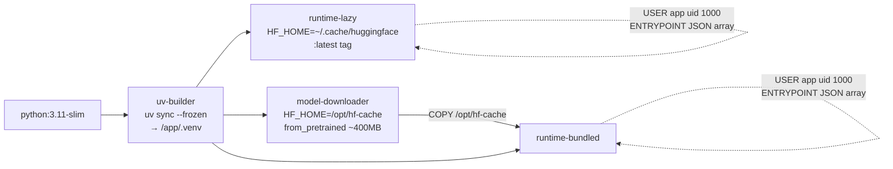

# Phase 7 Plan 3: Docker Images Summary

Multi-stage Dockerfile + verb-dispatching entrypoint + build-context filter that produce the `:latest` (lazy model download) and `:bundled` (TimesFM 2.5 pre-baked into `/opt/hf-cache`) images Plan 2's publish workflow will push to GHCR.

## What Changed

Three new files at repo root — the complete Docker build contract for Phase 7:

1. **`Dockerfile`** (107 lines, 4 stages, 2 buildable targets) — multi-stage layout with `uv-builder` (shared venv install), `runtime-lazy` (final `:latest` tag, model downloads on first use), `model-downloader` (derived from `uv-builder`, runs `TimesFM_2p5_200M_torch.from_pretrained` with `HF_HOME=/opt/hf-cache`), and `runtime-bundled` (final `:bundled` tag, copies venv + pre-baked weights).

2. **`docker-entrypoint.sh`** (35 lines, bash) — `set -euo pipefail` verb dispatcher. No arg OR `mcp` first arg → `exec shopify-forecast-mcp`. Any of `revenue | demand | promo | compare | scenarios | auth | --help | -h` → `exec shopify-forecast`. Unknown first arg → exit 2 + usage to stderr (T-07-05 mitigation: no silent MCP start on garbage args).

3. **`.dockerignore`** (57 lines) — excludes `.env` / `.env.*` (D-09 secrets), `.planning/`, `.claude/`, `tests/`, `scripts/`, `docs/superpowers/`, virtualenvs, Python caches, `.git/`. Allowlists `.env.example` via negation. Intentionally does NOT exclude `Dockerfile` or `docker-entrypoint.sh` (both are consumed by the build — excluding would break `COPY docker-entrypoint.sh /app/entrypoint.sh`).

## Stage Dependency Graph



Two **final** targets (`runtime-lazy` and `runtime-bundled`) are buildable with `docker buildx build --target runtime-${variant}`. The `model-downloader` stage exists only as a weight-producer for `runtime-bundled` — never tagged as a final image itself.

## Image Size Estimates (from RESEARCH Pattern 3)

| Variant | Expected size | Notes |
|---------|---------------|-------|
| `:latest` (runtime-lazy) | ~1.5–2 GB | CPU torch wheel dominates; model downloads at runtime to `/home/app/.cache/huggingface` |
| `:bundled` (runtime-bundled) | ~2–2.5 GB | Adds ~400MB of TimesFM 2.5 weights under `/opt/hf-cache` — `docker run --network=none` capable |

Actual sizes will be measured in Plan 5's rc1 dry-run.

## Plan 2 Contract (stage-name matching)

Plan 2's `publish.yml` references these stages via matrix-indexed targets. Grep evidence confirms exact match:

```
$ grep -F "AS runtime-lazy" Dockerfile
FROM python:3.11-slim AS runtime-lazy

$ grep -F "AS runtime-bundled" Dockerfile
FROM python:3.11-slim AS runtime-bundled
```

Plan 2 uses `target: runtime-${{ matrix.variant }}` where `matrix.variant ∈ {lazy, bundled}` → expands to `target: runtime-lazy` and `target: runtime-bundled`. Both are present. Contract satisfied.

## Entrypoint Dispatch (D-10 verb list)

Full verb set handled by `docker-entrypoint.sh`:

| First arg | Dispatches to | Notes |
|-----------|---------------|-------|
| *(empty)* | `shopify-forecast-mcp` | Default: MCP server over stdio |
| `mcp` | `shopify-forecast-mcp` | Explicit form; arg shifted off before exec |
| `revenue` | `shopify-forecast revenue …` | Phase 4 CLI verb |
| `demand` | `shopify-forecast demand …` | Phase 4 CLI verb |
| `promo` | `shopify-forecast promo …` | Phase 5 CLI verb |
| `compare` | `shopify-forecast compare …` | Phase 5 CLI verb |
| `scenarios` | `shopify-forecast scenarios …` | Phase 6 CLI verb |
| `auth` | `shopify-forecast auth …` | Phase 4.1 CLI verb — dispatched for help output; actual browser OAuth will fail in headless container (D-09 noted in SETUP.md) |
| `--help` / `-h` | `shopify-forecast --help` | Pass-through to argparse |
| anything else | exit 2 + usage to stderr | T-07-05 mitigation |

Demo use case (bundled variant, zero-install one-shot forecast):

```bash
docker run --rm \
  -e SHOPIFY_FORECAST_SHOP=mystore.myshopify.com \
  -e SHOPIFY_FORECAST_ACCESS_TOKEN=shpat_xxx \
  ghcr.io/omnialta/shopify-forecast-mcp:bundled \
  revenue --horizon 30
```

## Security Mitigations Applied (STRIDE)

| Threat ID | Mitigation | Evidence |
|-----------|-----------|----------|
| T-07-05 Elevation of Privilege (arg dispatch) | Explicit verb whitelist; unknown → exit 2 | `grep "Unknown command" docker-entrypoint.sh` present |
| T-07-11 EoP (root container) | `USER app` (uid 1000) in both runtime stages before ENTRYPOINT | `grep -c "USER app" Dockerfile` → 2 |
| T-07-12 Info Disclosure (secrets in image) | `.dockerignore` excludes `.env`, `*.pem`, `*.key`; no ENV directives set creds | `grep -F ".env" Dockerfile` → no matches |
| T-07-13 DoS (SIGTERM not reaching Python) | JSON-array ENTRYPOINT + `exec` in both entrypoint branches | `grep -c 'ENTRYPOINT \["/app/entrypoint.sh"\]' Dockerfile` → 2; `grep -c "^[[:space:]]*exec " docker-entrypoint.sh` → 2 |
| T-07-15 Info Disclosure (Shopify CLI in image) | No `apt-get install`, no `shopify` binary; CLI path unavailable in container | `grep -i shopify Dockerfile` → only in top-level comment |

Residual accepted: T-07-14 (HF model weight integrity — accepted for v0.1.0 solo launch; sigstore/SBOM deferred to v0.2).

## Verification Results

| Check | Result |
|-------|--------|
| `uv run pytest -x -q tests/test_dockerfile_structure.py` | 12 passed, 0 skipped |
| Full non-slow test suite (`pytest -m "not slow and not integration"`) | 319 passed, 35 skipped, 0 failed |
| `bash -n docker-entrypoint.sh` | exit 0 |
| `test -x docker-entrypoint.sh` | pass (permissions 755) |
| `grep -c "FROM python:3.11-slim" Dockerfile` | 3 (expected 3) |
| `grep -c "HF_HOME=/opt/hf-cache" Dockerfile` | 2 (model-downloader + runtime-bundled; Pitfall 3 fix) |
| `grep -c "USER app" Dockerfile` | 2 (both runtime stages) |
| `grep -c 'ENTRYPOINT \["/app/entrypoint.sh"\]' Dockerfile` | 2 (both runtime stages) |
| `grep -c "^[[:space:]]*exec " docker-entrypoint.sh` | 2 (both case branches) |
| `.dockerignore` contains `.planning`, `.venv`, `tests/`, `.pytest_cache`, `.env`, `.git` | All present |
| `.dockerignore` does NOT list `Dockerfile` or `docker-entrypoint.sh` | Confirmed |

Local docker build not executed — VALIDATION.md allows CI-side validation (Plan 2 publish-docker job) as the primary build check, deferred to Plan 5 rc1 dry-run (up to 5-min feedback latency budget per VALIDATION.md).

## Deviations from Plan

None. Both files were written verbatim from the Plan 07-03 action blocks. No Rule 1/2/3 fix-ups required. The 35 test skips across the broader suite are all gated on Plan 2 / Plan 4 artifacts (`publish.yml`, `README.md` rewrite, `docs/SETUP.md`, `docs/TOOLS.md`, `docs/ARCHITECTURE.md`, `CHANGELOG.md`) — out of scope for this plan.

## Commits

| Task | Commit | Files |
|------|--------|-------|
| Task 1: Multistage Dockerfile | `c1d1b11` | `Dockerfile` |
| Task 2: Entrypoint + .dockerignore | `c91b6f1` | `docker-entrypoint.sh`, `.dockerignore` |

## Self-Check: PASSED

**Files verified to exist:**
- FOUND: `Dockerfile` (107 lines)
- FOUND: `docker-entrypoint.sh` (executable, 35 lines)
- FOUND: `.dockerignore` (57 lines)

**Commits verified in git log:**
- FOUND: `c1d1b11` feat(07-03): add multistage Dockerfile…
- FOUND: `c91b6f1` feat(07-03): add docker-entrypoint.sh verb dispatcher + .dockerignore

**Tests verified to pass:**
- FOUND: 12/12 tests in `tests/test_dockerfile_structure.py` green (0 skips)
- FOUND: 319/319 in full non-slow suite green (0 regressions)
