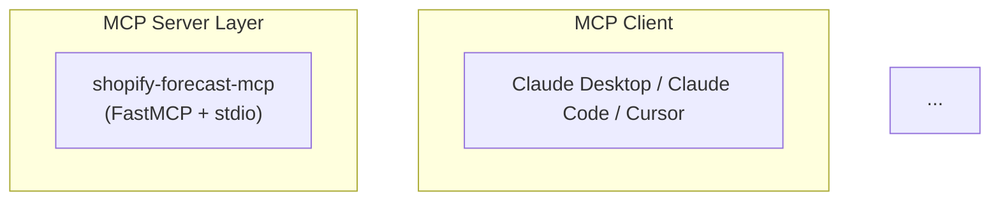
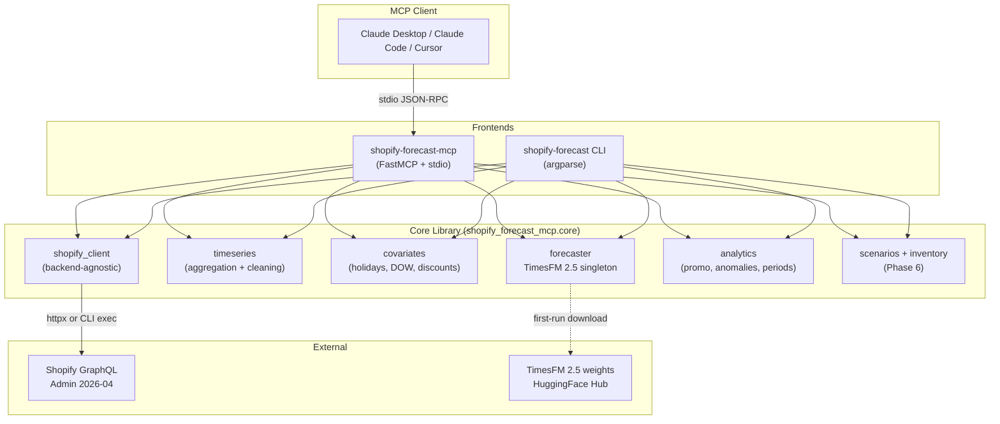

<objective>
Write the full documentation suite for v0.1.0: `README.md` (full rewrite from 337-byte placeholder), `CHANGELOG.md` (seeded with [0.1.0] per D-21), `docs/SETUP.md`, `docs/ARCHITECTURE.md` (3 Mermaid diagrams), and `docs/TOOLS.md` (generated-then-enriched from `scripts/gen_tools_doc.py` output).

Purpose: Implements R11.1-R11.5 (documentation requirements) and D-12 through D-18, D-21 (documentation scope + CHANGELOG). Enables the "clone-to-running in under 5 minutes" success criterion (Phase 7 success criterion 1). The CHANGELOG also feeds the GitHub Release body via Plan 2's `ffurrer2/extract-release-notes` action at rc1/v0.1.0 tag time.

Output: 6 new doc files + gitkeep. Every downstream assertion in Plan 01's `tests/test_docs_completeness.py` and `tests/test_changelog_structure.py` and `tests/test_claude_desktop_snippet.py` passes.

**Depends on Plan 01** because:
- `scripts/gen_tools_doc.py` is used as the starting point for `docs/TOOLS.md` (Task 3 runs it + enriches).
- `tests/test_docs_completeness.py`, `tests/test_changelog_structure.py`, `tests/test_claude_desktop_snippet.py` — all three Wave-0 test files provide the structural contracts this plan's artifacts must satisfy.

**Parallel with Plans 02 + 03** in Wave 2: no file overlap, no build-time coupling.
</objective>

<execution_context>
@$HOME/.claude/get-shit-done/workflows/execute-plan.md
@$HOME/.claude/get-shit-done/templates/summary.md
</execution_context>

<context>
@.planning/PROJECT.md
@.planning/REQUIREMENTS.md
@.planning/ROADMAP.md
@.planning/phases/07-distribution-docs/07-CONTEXT.md
@.planning/phases/07-distribution-docs/07-RESEARCH.md
@.planning/phases/07-distribution-docs/07-01-SUMMARY.md
@src/shopify_forecast_mcp/mcp/tools.py
@src/shopify_forecast_mcp/cli.py
@src/shopify_forecast_mcp/config.py
@.env.example
@tests/test_docs_completeness.py
@tests/test_changelog_structure.py
@tests/test_claude_desktop_snippet.py
@scripts/gen_tools_doc.py

<interfaces>
From `src/shopify_forecast_mcp/mcp/tools.py` — the 7 tools to document in README table + TOOLS.md sections:

| Tool | Purpose | Phase introduced |
|------|---------|------------------|
| `forecast_revenue` | Store-level revenue forecast with confidence bands | Phase 4 |
| `forecast_demand` | Product/collection/SKU demand + reorder alerts | Phase 4 + Phase 6 (reorder) |
| `analyze_promotion` | Past promo vs baseline with lift, AOV, hangover | Phase 5 |
| `detect_anomalies` | Flag days falling outside quantile bands | Phase 5 |
| `compare_periods` | YoY / MoM period comparison | Phase 5 |
| `get_seasonality` | Explain learned seasonal patterns | Phase 5 |
| `compare_scenarios` | What-if forecasting with 2-4 scenario variants | Phase 6 |

From `src/shopify_forecast_mcp/cli.py` — CLI verbs available:
- `shopify-forecast revenue [--horizon N] [--context N] [--frequency daily|weekly|monthly] [--json] [--store STORE]`
- `shopify-forecast demand [--group-by product|collection|sku] [--group-value ID] [--metric units|revenue|orders] [--horizon N] [--top-n N] [--store STORE]`
- `shopify-forecast promo --start DATE --end DATE [--baseline-days N] [--store STORE]` (Phase 5 D-23)
- `shopify-forecast compare --period-a START:END --period-b START:END [--store STORE]` (Phase 5 D-23)
- `shopify-forecast auth --store DOMAIN` (Phase 4.1 — browser OAuth; does NOT work in Docker per D-09)

From `src/shopify_forecast_mcp/config.py` — env vars documented in SETUP.md:

```
SHOPIFY_FORECAST_SHOP=mystore.myshopify.com           # required
SHOPIFY_FORECAST_ACCESS_TOKEN=shpat_xxx               # required (except Phase 4.1 CLI mode on host)
SHOPIFY_FORECAST_API_VERSION=2026-04                  # optional, default 2026-04
SHOPIFY_FORECAST_TIMESFM_DEVICE=cpu                   # cpu (default) or cuda
SHOPIFY_FORECAST_TIMESFM_CONTEXT_LENGTH=1024          # optional
SHOPIFY_FORECAST_TIMESFM_HORIZON=90                   # optional
SHOPIFY_FORECAST_COVARIATES_ENABLED=false             # Phase 5 XReg feature flag
SHOPIFY_FORECAST_FORECAST_CACHE_TTL=3600              # optional, seconds
SHOPIFY_FORECAST_LOG_LEVEL=INFO                       # optional
SHOPIFY_FORECAST_HF_HOME=/opt/hf-cache                # optional (Docker :bundled sets this)
SHOPIFY_FORECAST_DEFAULT_STORE=us-store               # multi-store only (Phase 6)
# Multi-store (pydantic-settings nested env convention):
SHOPIFY_FORECAST_STORES__0__SHOP=eu.myshopify.com
SHOPIFY_FORECAST_STORES__0__ACCESS_TOKEN=shpat_eu
SHOPIFY_FORECAST_STORES__0__LABEL=EU Store
```

From RESEARCH §"Mermaid two-layer architecture diagram" — the canonical diagram syntax that renders on GitHub:

```

```

The 3 mermaid diagrams required by D-14:
1. **Two-layer architecture** — MCP Client → MCP Server Layer → Core Library → External (Shopify + HF).
2. **Data flow pipeline** — Shopify GraphQL → fetch_orders (normalized) → orders_to_daily_series → clean/resample → ForecastEngine → ForecastResult → tool response.
3. **Backend selection tree** — create_backend(settings) → `access_token set?` → DirectBackend (httpx) | `shopify` CLI on PATH? → CliBackend | error.

From Phase 4.1 design doc (`docs/superpowers/specs/2026-04-16-shopify-cli-integration-design.md` referenced in planning_context) — dual-backend architecture language for ARCHITECTURE.md.
</interfaces>
</context>

<tasks>

<task type="auto" tdd="false">
  <name>Task 1: Write README.md + CHANGELOG.md + docs/images/.gitkeep</name>
  <files>README.md, CHANGELOG.md, docs/images/.gitkeep</files>
  <read_first>
    - README.md (current 337-byte placeholder — will be OVERWRITTEN)
    - .planning/PROJECT.md §"What This Is" + §"Core Value" (merchant-first framing source for README one-liner + Why section)
    - .planning/phases/07-distribution-docs/07-CONTEXT.md (D-16 README structure locked; D-18 alpha banner; D-21 CHANGELOG format; D-13 MCP client coverage tiers)
    - .planning/phases/07-distribution-docs/07-RESEARCH.md (§"Pattern 5: Keep a Changelog extraction" for CHANGELOG format; §"Pitfall 7" for mermaid PNG fallback decision)
    - .planning/ROADMAP.md §"Phase 1" through §"Phase 6" (source of truth for CHANGELOG [0.1.0] Added entries)
    - tests/test_docs_completeness.py + tests/test_changelog_structure.py + tests/test_claude_desktop_snippet.py (Plan 01 — structural contracts)
    - src/shopify_forecast_mcp/config.py (confirm env var names are current)
  </read_first>
  <action>
**File 1: `README.md`** — full rewrite per D-16 locked structure. Overwrite the current 337-byte placeholder entirely.

Required structure (D-16, in order):
1. `# shopify-forecast-mcp` header
2. Alpha banner (D-18) — `> ⚠️ **v0.1.0 Alpha** — Early release...`
3. One-liner (1-2 sentences, merchant-focused)
4. `## Why` section (merchant value, not tech flex — adapt from PROJECT.md Core Value)
5. `## Quick start` section with 3 steps: install uv → configure Shopify env → add to Claude Desktop
6. `## Examples` (4 conversation examples per D-16 + CONTEXT §specifics)
7. `## Tools` — table of 7 tools with anchor links to docs/TOOLS.md
8. `## Architecture` — summary + link to docs/ARCHITECTURE.md (per Pitfall 7, use prose summary; mermaid lives in ARCHITECTURE.md)
9. `## Configuration` — summary table of required env vars + link to docs/SETUP.md
10. `## CLI` — one-liner summary + deep link to SETUP.md CLI section
11. `## Roadmap` — link to .planning/ROADMAP.md
12. `## Contributing` — one paragraph, GitHub issues welcome
13. `## License` — MIT + link

Write the following content to `README.md`:

```markdown
# shopify-forecast-mcp

> ⚠️ **v0.1.0 Alpha** — Early release. API surface may change before v0.2. Feedback welcome: [open an issue](https://github.com/mcostigliola321/shopify-forecast-mcp/issues).

Merchant-native MCP server that connects Google's TimesFM 2.5 time-series foundation model to your Shopify store — so your AI assistant can answer "what does next month look like?" with a real forecast grounded in your order history.

No dashboards, no exports, no per-store training. Works with Claude Desktop, Claude Code, Cursor, and any MCP-compatible AI client.

***

## Why

Shopify has four official MCP servers, all buyer-facing or developer-facing. None serve merchant operations: forecasting, demand planning, promo analysis, anomaly detection.

Existing third-party tools either use weak models (moving averages, Prophet) or lock insights inside closed SaaS dashboards. This one:

- Runs **TimesFM 2.5** (Google's 200M-param foundation model) — state of the art on the GIFT-Eval retail benchmark
- Pulls directly from **Shopify Admin GraphQL** with bulk operations, refund-aware normalization, multi-currency, and cost-based rate limiting
- Returns **markdown tables with confidence bands** that render natively in your MCP client
- Ships as a single `uvx` command — zero manual Python setup
- Is **MIT licensed, free forever**

***

## Quick start

Three steps to a working forecast in under 5 minutes:

### 1. Install `uv` (once)

```bash
# macOS / Linux
curl -LsSf https://astral.sh/uv/install.sh | sh

# Windows (PowerShell)
irm https://astral.sh/uv/install.ps1 | iex
```

### 2. Get a Shopify Admin API access token

Follow [docs/SETUP.md](docs/SETUP.md) to create a custom app, enable the required scopes (`read_orders`, `read_all_orders`, `read_products`, `read_inventory`), and generate an access token.

### 3. Add to Claude Desktop

Edit `~/Library/Application Support/Claude/claude_desktop_config.json` (macOS) or `%APPDATA%\Claude\claude_desktop_config.json` (Windows) and add:

```json
{
  "mcpServers": {
    "shopify-forecast": {
      "command": "uvx",
      "args": ["shopify-forecast-mcp"],
      "env": {
        "SHOPIFY_FORECAST_SHOP": "mystore.myshopify.com",
        "SHOPIFY_FORECAST_ACCESS_TOKEN": "shpat_xxxxxxxxxxxxxxxxxxxxxxxx"
      }
    }
  }
}
```

Restart Claude Desktop, then ask: **"What does next month look like?"**

First run downloads TimesFM 2.5 weights (~400MB, one-time). Subsequent forecasts are <10 seconds.

> **Alpha pre-release:** if installing v0.1.0-rc1, use `"args": ["--prerelease=allow", "shopify-forecast-mcp@0.1.0rc1"]` instead.

See also: [docs/SETUP.md](docs/SETUP.md) for Claude Code + generic MCP client setup, Docker install, and multi-store configuration.

***

## Examples

Drop these into your AI client after setup:

**Revenue forecasting** — *"What does next month look like?"*
Returns a daily-granularity revenue forecast for the next 30 days with an 80% confidence band (q10–q90).

**Demand + reorder alerts** — *"Which SKUs need to be reordered in the next 2 weeks?"*
Returns top-N SKUs with projected demand vs current inventory, flagging stockout risk.

**Promo analysis** — *"How did Black Friday perform vs last year?"*
Returns revenue lift, order lift, AOV change, discount depth, and post-promo hangover estimate for both windows side by side.

**Scenario planning** — *"Compare 3 promo scenarios for December: 10% off, 20% off + free shipping, and BOGO."*
Returns 3 differentiated forecasts in one markdown response with per-scenario revenue, units, and margin implications.

***

## Tools

Seven MCP tools, full reference in [docs/TOOLS.md](docs/TOOLS.md):

| Tool | Purpose |
|------|---------|
| [`forecast_revenue`](docs/TOOLS.md#forecast-revenue) | Store-level revenue forecast with confidence bands |
| [`forecast_demand`](docs/TOOLS.md#forecast-demand) | Product/collection/SKU demand + reorder alerts |
| [`analyze_promotion`](docs/TOOLS.md#analyze-promotion) | Past promo vs baseline — lift, AOV, hangover |
| [`detect_anomalies`](docs/TOOLS.md#detect-anomalies) | Flag days outside forecast quantile bands |
| [`compare_periods`](docs/TOOLS.md#compare-periods) | Year-over-year / month-over-month comparison |
| [`compare_scenarios`](docs/TOOLS.md#compare-scenarios) | What-if forecasting across 2-4 scenarios |
| [`get_seasonality`](docs/TOOLS.md#get-seasonality) | Explain learned seasonal patterns |

***

## Architecture

Two-layer design: a pure-Python **core library** (Shopify client, time-series shaping, TimesFM forecaster, analytics, covariates) wrapped by a **thin MCP server** and a **matching CLI**. Core is importable and testable without the MCP runtime.

Dual-backend Shopify access: **DirectBackend** (httpx + access token, used in Docker and when `SHOPIFY_FORECAST_ACCESS_TOKEN` is set) or **CliBackend** (`shopify store execute` — browser OAuth, no token required, host-only).

Full diagrams + design decisions in [docs/ARCHITECTURE.md](docs/ARCHITECTURE.md).

***

## Configuration

Minimum required env vars:

| Variable | Purpose |
|----------|---------|
| `SHOPIFY_FORECAST_SHOP` | Your store domain (e.g. `mystore.myshopify.com`) |
| `SHOPIFY_FORECAST_ACCESS_TOKEN` | Admin API access token (from custom app) |

See [docs/SETUP.md](docs/SETUP.md) for the full env var table, multi-store config, Docker env passing, and optional tuning knobs.

***

## CLI

A standalone `shopify-forecast` CLI wraps the same core library without the MCP runtime — useful for scripting, cron, and CI:

```bash
uvx --from shopify-forecast-mcp shopify-forecast revenue --horizon 30
uvx --from shopify-forecast-mcp shopify-forecast demand --group-by product --top-n 10
uvx --from shopify-forecast-mcp shopify-forecast promo --start 2025-11-24 --end 2025-11-30
uvx --from shopify-forecast-mcp shopify-forecast compare --period-a 2024-11:2024-12 --period-b 2025-11:2025-12
```

Add `--json` to any verb for machine-readable output. See [docs/SETUP.md#cli-usage](docs/SETUP.md#cli-usage) for the full CLI reference.

***

## Docker

Run the MCP server (or any CLI verb) without installing Python:

```bash
docker run --rm -i \
  -e SHOPIFY_FORECAST_SHOP=mystore.myshopify.com \
  -e SHOPIFY_FORECAST_ACCESS_TOKEN=shpat_xxx \
  ghcr.io/mcostigliola321/shopify-forecast-mcp:latest
```

Two image variants:
- **`:latest`** — lazy model download on first call (smaller image, ~1.5GB)
- **`:bundled`** — TimesFM weights baked in (larger image, ~2.5GB, offline-capable)

Browser-based OAuth does NOT work in containers; Docker mode requires the access-token env var. See [docs/SETUP.md#docker](docs/SETUP.md#docker).

***

## Roadmap

v0.1.0 is the first public alpha, covering the full MVP (7 MCP tools + 4 CLI verbs + dual-backend). Future: see [.planning/ROADMAP.md](.planning/ROADMAP.md).

***

## Contributing

Feedback and bug reports welcome at [GitHub Issues](https://github.com/mcostigliola321/shopify-forecast-mcp/issues). For code contributions, see [docs/ARCHITECTURE.md](docs/ARCHITECTURE.md) for the two-layer design and open a draft PR early.

***

## License

[MIT](LICENSE). TimesFM 2.5 weights are [Apache 2.0](https://huggingface.co/google/timesfm-2.5-200m-pytorch) (compatible).
```

**Critical placeholder discipline** (per `test_no_placeholder_tokens_in_docs`):
- All `shpat_xxx` / `shpat_xxxxx` / `mystore.myshopify.com` MUST be inside fenced code blocks (they are in the snippet above — `test_no_placeholder_tokens_in_docs` strips ```` ```...``` ```` regions before checking).
- No `TODO`, `XXX`, `FIXME`, `[date]`, `[TBD]` outside code blocks.
- No real credentials.

**File 2: `CHANGELOG.md`** — Keep a Changelog 1.1.0, seeded with [0.1.0] per D-21.

Write the following content to `CHANGELOG.md`:

```markdown
# Changelog

All notable changes to this project will be documented in this file.

The format is based on [Keep a Changelog](https://keepachangelog.com/en/1.1.0/),
and this project adheres to [Semantic Versioning](https://semver.org/spec/v2.0.0.html).

## [Unreleased]

## [0.1.0] - 2026-04-19

First public alpha release. MVP covers the full 7-tool MCP surface plus a standalone CLI, dual-backend Shopify access, and both lazy + bundled Docker image variants.

### Added

- **Seven MCP tools** exposed via FastMCP over stdio:
  - `forecast_revenue` — store-level revenue forecast with TimesFM 2.5 quantile bands
  - `forecast_demand` — product / collection / SKU demand with inventory-aware reorder alerts
  - `analyze_promotion` — revenue lift, order lift, AOV change, discount depth, and post-promo hangover analysis
  - `detect_anomalies` — flag days falling outside forecast quantile bands with configurable sensitivity
  - `compare_periods` — year-over-year and month-over-month comparison across metrics
  - `compare_scenarios` — what-if forecasting with 2-4 promo / discount scenarios in one response
  - `get_seasonality` — surface learned day-of-week, monthly, and quarterly seasonal patterns
- **Standalone `shopify-forecast` CLI** with four verbs (`revenue`, `demand`, `promo`, `compare`) plus `auth` for browser OAuth
- **Dual-backend Shopify client** (Phase 4.1): `DirectBackend` (httpx + access token) as the default; `CliBackend` (`shopify store execute` — no token required) when the Shopify CLI is on PATH
- **Bulk operations lifecycle** for stores with >10k orders, with JSONL reconstruction and cost-based rate limiting
- **Refund-aware revenue normalization**: `subtotalPriceSet.shopMoney.amount` (not `totalPriceSet`), line-item-level refund accounting
- **Timezone-correct bucketing**: orders bucketed by shop's `ianaTimezone`, not UTC (fixes midnight misclassification)
- **Multi-store support** (Phase 6): configure N additional stores via nested env vars (`SHOPIFY_FORECAST_STORES__0__SHOP` etc.); every tool accepts an optional `store` parameter
- **Covariate engineering** (Phase 5, feature-flagged): day-of-week, weekend, month, holidays (60+ countries via `holidays` package), holiday proximity windows, discount flags, custom events — off by default, opt in via `SHOPIFY_FORECAST_COVARIATES_ENABLED=true` or tool param
- **TimesFM 2.5 singleton loader** with compile-time config (`max_context=1024`, `max_horizon=256`, continuous quantile head, normalized inputs, flip invariance, positive inference, fix quantile crossing)
- **Local order cache** keyed by date range with 1-hour default TTL (`SHOPIFY_FORECAST_FORECAST_CACHE_TTL`)
- **`uvx shopify-forecast-mcp` install path** — zero manual Python setup
- **Docker images** on GHCR: `ghcr.io/mcostigliola321/shopify-forecast-mcp:latest` (lazy model download) and `:bundled` (TimesFM baked in at `/opt/hf-cache`), multi-arch for `linux/amd64` + `linux/arm64`
- **Trusted Publisher OIDC** publish flow to PyPI — no static tokens in the repo
- **Full documentation suite**: `README.md`, `docs/SETUP.md`, `docs/TOOLS.md`, `docs/ARCHITECTURE.md` with three Mermaid diagrams

### Changed

- TimesFM dependency migrated from a `git+https://github.com/google-research/timesfm.git@<sha>` direct URL to the PyPI-resolvable community fork `timecopilot-timesfm>=0.2,<0.3` (same `TimesFM_2p5_200M_torch` API). Required for PyPI publish — the upstream package is not yet on PyPI with 2.5 support.

### Known Limitations

- Alpha quality — API surface may change before v0.2.
- Apple Silicon `mps` device not supported; Apple users run on CPU (TimesFM 2.5 source doesn't have an mps branch).
- Browser-based OAuth (`shopify store auth`) does not work inside Docker containers — use `SHOPIFY_FORECAST_ACCESS_TOKEN` env var instead.
- First-run TimesFM download is ~400MB; plan for 30-60 seconds of initial latency on uncached installs.
- `uvx` on a Python 3.12-only machine may need `uvx --python 3.11 shopify-forecast-mcp` (pyproject is pinned to `>=3.11,<3.12`).

[Unreleased]: https://github.com/mcostigliola321/shopify-forecast-mcp/compare/v0.1.0...HEAD
[0.1.0]: https://github.com/mcostigliola321/shopify-forecast-mcp/releases/tag/v0.1.0
```

**File 3: `docs/images/.gitkeep`** — empty file, placeholder for future screenshots in `docs/SETUP.md`.

```bash
mkdir -p docs/images && touch docs/images/.gitkeep
```
  </action>
  <verify>
    <automated>test -f README.md &amp;&amp; test -f CHANGELOG.md &amp;&amp; test -f docs/images/.gitkeep &amp;&amp; uv run pytest -x -q tests/test_docs_completeness.py::test_readme_exists tests/test_docs_completeness.py::test_readme_not_placeholder tests/test_docs_completeness.py::test_readme_has_alpha_banner tests/test_docs_completeness.py::test_readme_has_required_sections tests/test_docs_completeness.py::test_readme_shows_uvx_invocation tests/test_docs_completeness.py::test_readme_has_claude_desktop_snippet tests/test_changelog_structure.py tests/test_claude_desktop_snippet.py::test_readme_snippet_uses_uvx_command</automated>
  </verify>
  <acceptance_criteria>
    - `README.md` is >2000 bytes (rewritten from 337-byte placeholder).
    - `README.md` has alpha banner on line 3 (`⚠️ **v0.1.0 Alpha**` or similar).
    - `README.md` has sections: `## Why`, `## Quick start`, `## Examples`, `## Tools`, `## Architecture`, `## Configuration`, `## CLI`, `## License` — `grep -c "^## " README.md` returns at least 8.
    - `README.md` contains `uvx shopify-forecast-mcp` in a code block.
    - `README.md` contains a JSON code block with `"mcpServers"` and `"command": "uvx"` keys.
    - `README.md` references `docs/SETUP.md`, `docs/TOOLS.md`, `docs/ARCHITECTURE.md` as relative links.
    - `README.md` has 4 conversation examples mentioning the 4 tool families per D-16.
    - `CHANGELOG.md` starts with `# Changelog`.
    - `CHANGELOG.md` contains `## [Unreleased]` and `## [0.1.0] - 2026-04-19` sections.
    - `CHANGELOG.md` [0.1.0] has `### Added` subsection.
    - `CHANGELOG.md` [0.1.0] mentions all 7 tool names: `grep -F "forecast_revenue" CHANGELOG.md && grep -F "forecast_demand" CHANGELOG.md && grep -F "analyze_promotion" CHANGELOG.md && grep -F "detect_anomalies" CHANGELOG.md && grep -F "compare_periods" CHANGELOG.md && grep -F "compare_scenarios" CHANGELOG.md && grep -F "get_seasonality" CHANGELOG.md`.
    - `CHANGELOG.md` mentions `keepachangelog.com` and `semver.org` (or "Semantic Versioning").
    - `docs/images/.gitkeep` exists.
    - `tests/test_changelog_structure.py` all 8 tests pass.
    - `test_readme_*` and `test_claude_desktop_snippet_*` tests in the `tests/` suite pass.
    - No placeholder tokens (`TODO`, `XXX`, `FIXME`, `[TBD]`, `[date]`) outside fenced code blocks in README or CHANGELOG.
  </acceptance_criteria>
  <done>README is merchant-first and complete; CHANGELOG is ready to be extracted by `ffurrer2/extract-release-notes` at rc1 tag time; image directory exists.</done>
</task>

<task type="auto" tdd="false">
  <name>Task 2: Write docs/SETUP.md + docs/ARCHITECTURE.md (3 Mermaid diagrams)</name>
  <files>docs/SETUP.md, docs/ARCHITECTURE.md</files>
  <read_first>
    - .planning/phases/07-distribution-docs/07-CONTEXT.md (D-14 mermaid diagrams required; D-17 SETUP.md scope)
    - .planning/phases/07-distribution-docs/07-RESEARCH.md (§"Mermaid two-layer architecture diagram" reference; §"Pitfall 7" mermaid on GitHub but not PyPI — keep diagrams in ARCHITECTURE.md, not README)
    - docs/superpowers/specs/2026-04-16-shopify-cli-integration-design.md (Phase 4.1 dual-backend source of truth for ARCHITECTURE.md §Dual backend)
    - src/shopify_forecast_mcp/config.py (env var names for SETUP.md table)
    - .env.example (verify current env var surface)
    - tests/test_docs_completeness.py (Plan 01 — `test_setup_*` and `test_architecture_*` assertions)
  </read_first>
  <action>
**File 1: `docs/SETUP.md`** — install walkthrough for merchants per D-17.

Write the following content to `docs/SETUP.md`:

```markdown
# Setup Guide

This guide gets you from zero to a working `shopify-forecast-mcp` in under 10 minutes. For the TL;DR install, see [README.md#quick-start](../README.md#quick-start).

> **For merchants:** you can follow every step with just a terminal and a Shopify admin login. For developers, see [ARCHITECTURE.md](ARCHITECTURE.md) for the two-layer design.

## Contents

- [Prerequisites](#prerequisites)
- [Step 1 — Create a Shopify custom app](#step-1--create-a-shopify-custom-app)
- [Step 2 — Install and configure](#step-2--install-and-configure)
- [Step 3 — Add to your MCP client](#step-3--add-to-your-mcp-client)
- [Docker install](#docker)
- [Multi-store configuration](#multi-store)
- [Environment variable reference](#environment-variable-reference)
- [CLI usage](#cli-usage)
- [Troubleshooting](#troubleshooting)

***

## Prerequisites

- A Shopify store with admin access
- Python 3.11 (installed automatically by `uvx`)
- One of: Claude Desktop, Claude Code, Cursor, or any other MCP-compatible client
- ~400MB disk space for TimesFM 2.5 weights (downloaded on first use)

***

## Step 1 — Create a Shopify custom app

`shopify-forecast-mcp` reads order + product + inventory data via Shopify's Admin GraphQL API. You need a private admin-scoped token.

1. In your Shopify admin, go to **Settings → Apps and sales channels → Develop apps**.
2. Click **Create an app** (name it `shopify-forecast-mcp` or similar).
3. Click **Configure Admin API scopes** and enable these four scopes:
   - `read_orders` — order data
   - `read_all_orders` — **required** for >60 days of history (the default `read_orders` scope is capped at 60 days)
   - `read_products` — product catalog for demand forecasting
   - `read_inventory` — inventory levels for reorder alerts
4. Click **Save**, then **Install app**.
5. Copy the **Admin API access token** (starts with `shpat_`). You won't see it again — save it now.

> **Alternative (host-only):** if you have the [Shopify CLI](https://shopify.dev/docs/api/shopify-cli) installed on your machine, you can run `shopify-forecast auth --store mystore.myshopify.com` to authenticate via browser OAuth instead of a manual token. This does NOT work inside Docker — see the [Docker](#docker) section.

***

## Step 2 — Install and configure

### Install `uv` (once)

```bash
# macOS / Linux
curl -LsSf https://astral.sh/uv/install.sh | sh

# Windows PowerShell
irm https://astral.sh/uv/install.ps1 | iex
```

### Configure environment variables

Create a `.env` file in your working directory (or export these in your shell):

```bash
SHOPIFY_FORECAST_SHOP=mystore.myshopify.com
SHOPIFY_FORECAST_ACCESS_TOKEN=shpat_xxxxxxxxxxxxxxxxxxxxxxxx
```

Test it:

```bash
uvx shopify-forecast revenue --horizon 7
```

If this prints a 7-day forecast table, you're ready. First run downloads TimesFM 2.5 weights (~400MB, one-time).

***

## Step 3 — Add to your MCP client

### Claude Desktop

Edit `~/Library/Application Support/Claude/claude_desktop_config.json` (macOS) or `%APPDATA%\Claude\claude_desktop_config.json` (Windows):

```json
{
  "mcpServers": {
    "shopify-forecast": {
      "command": "uvx",
      "args": ["shopify-forecast-mcp"],
      "env": {
        "SHOPIFY_FORECAST_SHOP": "mystore.myshopify.com",
        "SHOPIFY_FORECAST_ACCESS_TOKEN": "shpat_xxxxxxxxxxxxxxxxxxxxxxxx"
      }
    }
  }
}
```

Restart Claude Desktop. You should see `shopify-forecast` in the tools menu.

### Claude Code

```bash
claude mcp add shopify-forecast \
  --command uvx \
  --args shopify-forecast-mcp \
  --env SHOPIFY_FORECAST_SHOP=mystore.myshopify.com \
  --env SHOPIFY_FORECAST_ACCESS_TOKEN=shpat_xxxxxxxxxxxxxxxxxxxxxxxx
```

### Generic MCP client

The server speaks the [Model Context Protocol](https://modelcontextprotocol.io/) over stdio. Launch it with:

```bash
uvx shopify-forecast-mcp
```

It reads `SHOPIFY_FORECAST_*` env vars at startup. Any MCP-compatible client (Cursor, custom agents) can connect by invoking the command above with the env vars set.

### Alpha pre-release installation

v0.1.0-rc1 and earlier release candidates are published to PyPI as pre-releases. `uvx` skips pre-releases by default — use:

```bash
uvx --prerelease=allow shopify-forecast-mcp@0.1.0rc1
```

In Claude Desktop config:

```json
{
  "mcpServers": {
    "shopify-forecast": {
      "command": "uvx",
      "args": ["--prerelease=allow", "shopify-forecast-mcp@0.1.0rc1"],
      "env": { ... }
    }
  }
}
```

***

## Docker

Two image tags on GHCR (`ghcr.io/mcostigliola321/shopify-forecast-mcp`):

| Tag | Size | Model load |
|-----|------|------------|
| `:latest` | ~1.5 GB | Downloads on first forecast call |
| `:bundled` | ~2.5 GB | Weights baked in, offline-capable |

Run the MCP server:

```bash
docker run --rm -i \
  -e SHOPIFY_FORECAST_SHOP=mystore.myshopify.com \
  -e SHOPIFY_FORECAST_ACCESS_TOKEN=shpat_xxxxxxxxxxxxxxxxxxxxxxxx \
  ghcr.io/mcostigliola321/shopify-forecast-mcp:latest
```

Or dispatch a CLI verb directly:

```bash
docker run --rm \
  -e SHOPIFY_FORECAST_SHOP=mystore.myshopify.com \
  -e SHOPIFY_FORECAST_ACCESS_TOKEN=shpat_xxxxxxxxxxxxxxxxxxxxxxxx \
  ghcr.io/mcostigliola321/shopify-forecast-mcp:bundled revenue --horizon 30
```

> **Docker limitation:** the browser-based OAuth flow (`shopify-forecast auth`) cannot work inside a container — there's no browser. You MUST supply `SHOPIFY_FORECAST_ACCESS_TOKEN` via `-e` when running in Docker. This is enforced by the container's DirectBackend-only mode.

### Claude Desktop with Docker

```json
{
  "mcpServers": {
    "shopify-forecast": {
      "command": "docker",
      "args": [
        "run", "--rm", "-i",
        "-e", "SHOPIFY_FORECAST_SHOP=mystore.myshopify.com",
        "-e", "SHOPIFY_FORECAST_ACCESS_TOKEN=shpat_xxxxxxxxxxxxxxxxxxxxxxxx",
        "ghcr.io/mcostigliola321/shopify-forecast-mcp:bundled"
      ]
    }
  }
}
```

***

## Multi-store

If you operate multiple Shopify stores, configure them via the nested env-var convention (pydantic-settings):

```bash
# Default / primary store
SHOPIFY_FORECAST_SHOP=us-store.myshopify.com
SHOPIFY_FORECAST_ACCESS_TOKEN=shpat_usxxxxxxxx

# Additional stores indexed from 0
SHOPIFY_FORECAST_STORES__0__SHOP=eu-store.myshopify.com
SHOPIFY_FORECAST_STORES__0__ACCESS_TOKEN=shpat_euxxxxxxxx
SHOPIFY_FORECAST_STORES__0__LABEL=EU Store

SHOPIFY_FORECAST_STORES__1__SHOP=uk-store.myshopify.com
SHOPIFY_FORECAST_STORES__1__ACCESS_TOKEN=shpat_ukxxxxxxxx
SHOPIFY_FORECAST_STORES__1__LABEL=UK Store

SHOPIFY_FORECAST_DEFAULT_STORE=us-store.myshopify.com
```

Every MCP tool accepts an optional `store` parameter (domain or label) to target a specific store without restart.

For Claude Desktop, serialize the `stores` list as a JSON string:

```json
{
  "mcpServers": {
    "shopify-forecast": {
      "command": "uvx",
      "args": ["shopify-forecast-mcp"],
      "env": {
        "SHOPIFY_FORECAST_SHOP": "us-store.myshopify.com",
        "SHOPIFY_FORECAST_ACCESS_TOKEN": "shpat_usxxxxxxxx",
        "SHOPIFY_FORECAST_STORES": "[{\"shop\":\"eu-store.myshopify.com\",\"access_token\":\"shpat_euxxxxxxxx\",\"label\":\"EU Store\"}]",
        "SHOPIFY_FORECAST_DEFAULT_STORE": "us-store.myshopify.com"
      }
    }
  }
}
```

***

## Environment variable reference

All variables are prefixed `SHOPIFY_FORECAST_`. Full list:

| Variable | Required | Default | Purpose |
|----------|----------|---------|---------|
| `SHOPIFY_FORECAST_SHOP` | yes | — | Primary store domain (e.g. `mystore.myshopify.com`) |
| `SHOPIFY_FORECAST_ACCESS_TOKEN` | yes* | — | Admin API access token (*optional when using Shopify CLI host-mode) |
| `SHOPIFY_FORECAST_API_VERSION` | no | `2026-04` | GraphQL Admin API version |
| `SHOPIFY_FORECAST_TIMESFM_DEVICE` | no | `cpu` | `cpu` or `cuda`. No `mps` (Apple Silicon runs on CPU) |
| `SHOPIFY_FORECAST_TIMESFM_CONTEXT_LENGTH` | no | `1024` | TimesFM context window |
| `SHOPIFY_FORECAST_TIMESFM_HORIZON` | no | `90` | TimesFM max horizon |
| `SHOPIFY_FORECAST_COVARIATES_ENABLED` | no | `false` | Enable XReg covariates (Phase 5 feature flag) |
| `SHOPIFY_FORECAST_FORECAST_CACHE_TTL` | no | `3600` | Order cache TTL in seconds |
| `SHOPIFY_FORECAST_LOG_LEVEL` | no | `INFO` | Python logging level |
| `SHOPIFY_FORECAST_HF_HOME` | no | HF default | Override HuggingFace cache dir (Docker `:bundled` uses `/opt/hf-cache`) |
| `SHOPIFY_FORECAST_DEFAULT_STORE` | no | — | Multi-store: default target when no `store` param passed |
| `SHOPIFY_FORECAST_STORES__N__SHOP` | no | — | Multi-store: additional store domain at index N |
| `SHOPIFY_FORECAST_STORES__N__ACCESS_TOKEN` | no | — | Multi-store: additional store token |
| `SHOPIFY_FORECAST_STORES__N__LABEL` | no | — | Multi-store: friendly label for store at index N |

See also: `.env.example` in the repo root.

***

## CLI usage

The standalone CLI runs the same core without the MCP runtime — useful for scripting, cron, and CI.

### `revenue`

```bash
shopify-forecast revenue [--horizon N] [--context N] [--frequency daily|weekly|monthly] [--json] [--store STORE]
```

Store-level revenue forecast. Defaults: 30-day horizon, 365-day context, daily frequency.

### `demand`

```bash
shopify-forecast demand [--group-by product|collection|sku] [--group-value ID|all] [--metric units|revenue|orders] [--horizon N] [--top-n N] [--store STORE]
```

Product / collection / SKU demand with reorder alerts when projected demand exceeds on-hand inventory.

### `promo`

```bash
shopify-forecast promo --start YYYY-MM-DD --end YYYY-MM-DD [--baseline-days N] [--store STORE]
```

Analyze a past promo window against the prior N-day baseline. Returns lift, AOV change, hangover.

### `compare`

```bash
shopify-forecast compare --period-a YYYY-MM-DD:YYYY-MM-DD --period-b YYYY-MM-DD:YYYY-MM-DD [--store STORE]
```

Year-over-year or month-over-month comparison across metrics.

### `auth` (host-only)

```bash
shopify-forecast auth --store mystore.myshopify.com
```

Browser OAuth via Shopify CLI (does NOT work in Docker). Requires `shopify` CLI on PATH.

Add `--json` to any verb for machine-readable output.

***

## Troubleshooting

**"No compatible Python found"** — `uvx` picks the latest installed Python by default. Force 3.11 with `uvx --python 3.11 shopify-forecast-mcp`.

**First run is slow** — TimesFM 2.5 weights (~400MB) download on first forecast. Subsequent calls are <10s. For offline use, `docker run ghcr.io/mcostigliola321/shopify-forecast-mcp:bundled` has the weights baked in.

**"No orders found"** — verify `SHOPIFY_FORECAST_SHOP` matches your exact `.myshopify.com` domain, and the access token has all four required scopes (especially `read_all_orders` for more than 60 days of history).

**Rate limiting / THROTTLED** — the client backs off automatically on cost-based throttling. Large initial fetches (>10k orders) use the bulk-operations path, which can take up to 60 seconds.

**Claude Desktop can't find the server** — restart Claude Desktop fully (quit + relaunch). Check `~/Library/Logs/Claude/mcp*.log` (macOS) for startup errors.

**Apple Silicon (M-series) performance** — TimesFM 2.5 source has no `mps` branch; Apple users run on CPU. Forecasts stay well under the 10s target for typical store volumes.

***

*Documentation for v0.1.0-alpha. See [CHANGELOG.md](../CHANGELOG.md) for release notes.*
```

**File 2: `docs/ARCHITECTURE.md`** — three Mermaid diagrams per D-14 + design decisions.

Write the following content to `docs/ARCHITECTURE.md`:

```markdown
# Architecture

Design overview of `shopify-forecast-mcp`. For install and usage, see [SETUP.md](SETUP.md) and [TOOLS.md](TOOLS.md).

## Contents

- [Two-layer design](#two-layer-design)
- [Data flow](#data-flow)
- [Dual-backend Shopify access](#dual-backend-shopify-access)
- [Key design decisions](#key-design-decisions)

***

## Two-layer design

A pure-Python **core library** wrapped by a thin **MCP server**. The CLI consumes the same core — no MCP runtime dependency. This enables standalone CLI use, unit testing without MCP, and future alternate frontends (web, Sidekick extension) without refactoring core.



Core is importable anywhere — `from shopify_forecast_mcp.core.forecaster import get_engine` works in a plain Python script. The MCP and CLI layers are thin orchestrators that turn user input into core calls and core results into markdown.

***

## Data flow

End-to-end: Shopify orders in, `ForecastResult` out.

```mermaid
flowchart LR
    A["Shopify GraphQL<br/>Admin 2026-04"]
    B["fetch_orders<br/>(paginated or bulk JSONL)"]
    C["Normalize<br/>- strip GIDs<br/>- net revenue from subtotalPriceSet<br/>- refund-aware line items<br/>- drop test/draft/cancelled<br/>- bucket by shop TZ"]
    D["orders_to_daily_series<br/>(pd.Series, DatetimeIndex)"]
    E["resample_series<br/>(D/W/M)"]
    F["clean_series<br/>(IQR outlier cap,<br/>no data removal)"]
    G["Optional: build_covariates<br/>(day-of-week, holidays,<br/>discount flags)"]
    H["ForecastEngine.forecast<br/>(TimesFM 2.5 singleton)"]
    I["ForecastResult<br/>- point_forecast<br/>- quantile_forecast<br/>  [mean, q10..q90]<br/>- confidence_bands<br/>- dates, metadata"]
    J["to_table() + summary()<br/>→ markdown response"]

    A --> B --> C --> D --> E --> F
    F --> H
    F -.->|if covariates_enabled| G
    G -.-> H
    H --> I --> J
```



Key invariants:
- **Singleton model loading**: TimesFM 2.5 loads once per server lifecycle, not per request (~800MB RAM; per-request loading would be unusable).
- **Markdown responses only**: tool results are markdown strings; the MCP client renders tables natively.
- **Never raise from tool handlers**: errors are caught per-tool and returned as friendly markdown (`R7.7`).
- **Stdout clean**: all Python logging goes to stderr (`R7.8`); stdio transport uses stdout only for JSON-RPC framing.

***

## Dual-backend Shopify access

`ShopifyClient` is backend-agnostic. At startup, a factory inspects the runtime and chooses between two implementations:

```mermaid
flowchart TD
    A["create_backend(settings)"]
    B{"SHOPIFY_FORECAST_ACCESS_TOKEN<br/>set in env?"}
    C["DirectBackend<br/>(httpx + Bearer token)"]
    D{"`shopify` CLI<br/>on PATH?"}
    E["CliBackend<br/>(shopify store execute,<br/>browser OAuth)"]
    F["ConfigurationError<br/>— no auth path available"]
    G["ShopifyClient<br/>(same public API)"]

    A --> B
    B -->|yes| C
    B -->|no| D
    D -->|yes| E
    D -->|no| F
    C --> G
    E --> G
```

| Backend | Auth | Used in | Trade-offs |
|---------|------|---------|------------|
| `DirectBackend` | Admin API access token (`shpat_...`) via env var | Docker (D-09), CI, any non-interactive shell | Requires manual token creation; works everywhere |
| `CliBackend` | Browser OAuth via `shopify store auth` | Host interactive use | No token to manage; requires Shopify CLI installed; doesn't work in containers |

Public API of `ShopifyClient` is identical across backends — the choice is transparent to core library consumers.

Both backends share identical normalization: `subtotalPriceSet.shopMoney.amount` (not `totalPriceSet`, which includes tax/shipping), refund-aware net revenue, timezone-correct bucketing by `ianaTimezone`, exclusion of test/draft/cancelled orders.

***

## Key design decisions

| Decision | Rationale | Location |
|----------|-----------|----------|
| **TimesFM 2.5 over Prophet/ARIMA** | Foundation model beats legacy methods on GIFT-Eval retail benchmark; zero-shot eliminates per-store training | `core/forecaster.py` |
| **Two-layer (core + MCP wrapper)** | Enables standalone CLI, unit testing without MCP runtime, future alternate frontends | `src/shopify_forecast_mcp/core/` vs `src/shopify_forecast_mcp/mcp/` |
| **Singleton TimesFM loading** | Model is ~800MB in memory; per-request loading is unusable | `core/forecaster.py` `get_engine()` |
| **Shopify GraphQL bulk ops** | Required for stores >10k orders; cost-based rate limit is more generous than REST | `core/shopify_client/bulk_ops.py` |
| **`subtotalPriceSet` for revenue** | Excludes tax + shipping — actual product revenue is what merchants forecast | `core/shopify_client/normalize.py` |
| **Markdown response format** | MCP clients render markdown natively; tables + summaries are merchant-readable | `mcp/tools.py` handlers |
| **Dual-backend architecture** | Merchant-on-laptop wants browser OAuth; server-side deploys need token-in-env | `core/shopify_backend/factory.py` |
| **TimesFM via `timecopilot-timesfm` PyPI fork** | Upstream `timesfm` on PyPI is still 2.0-only; PyPI rejects wheels with `git+https` deps. Community fork ships 2.5 under the same import path | `pyproject.toml` (Phase 7 D-23) |
| **Python 3.11 only (not 3.12)** | TimesFM + torch 3.12 compatibility not yet validated end-to-end; revisit in v0.2 | `pyproject.toml` `requires-python` |
| **`:bundled` Docker variant** | Merchants on spotty connections or privacy-conscious contexts benefit from offline-capable runtime; ~450MB image-size cost is acceptable | `Dockerfile` `runtime-bundled` stage |
| **Trusted Publisher OIDC (no PyPI token)** | Eliminates long-lived secret; short-lived OIDC tokens issued per workflow run | `.github/workflows/publish.yml` |
| **No npx wrapper** | `uvx` is the native Python equivalent; works in every MCP client config with no Node runtime | PRD §R12.5 |
| **Covariates off by default** | Marginal accuracy gain over TimesFM alone on most retail series; feature flag prevents surprise behavior | `SHOPIFY_FORECAST_COVARIATES_ENABLED` |
| **Stderr-only logging** | Stdio transport reserves stdout for JSON-RPC framing; any `print()` in server code would break the protocol | `R7.8` enforced across server |

For full requirement traceability, see [.planning/REQUIREMENTS.md](../.planning/REQUIREMENTS.md) and [.planning/ROADMAP.md](../.planning/ROADMAP.md).

***

*Documentation for v0.1.0-alpha.*
```

**Critical mermaid diagram requirements** (per D-14 + `test_architecture_has_three_mermaid_diagrams`):

- Count of ```` ```mermaid ```` openers in `docs/ARCHITECTURE.md` must be >= 3.
- The three required diagrams: (a) two-layer arch with client/frontends/core/external subgraphs; (b) data flow pipeline from Shopify GraphQL to ForecastResult; (c) backend selection tree with create_backend decision logic.
- Each diagram must be syntactically valid mermaid — GitHub's renderer will silently fail on syntax errors.
- Use `flowchart TB` or `flowchart TD` / `flowchart LR` (RESEARCH confirmed both work on GitHub since 2022).
- `DirectBackend` and `CliBackend` must both appear (per `test_architecture_mentions_dual_backend`).
  </action>
  <verify>
    <automated>test -f docs/SETUP.md &amp;&amp; test -f docs/ARCHITECTURE.md &amp;&amp; uv run pytest -x -q tests/test_docs_completeness.py::test_setup_md_exists tests/test_docs_completeness.py::test_setup_covers_required_scopes tests/test_docs_completeness.py::test_setup_covers_both_install_paths tests/test_docs_completeness.py::test_setup_has_env_var_table tests/test_docs_completeness.py::test_architecture_md_exists tests/test_docs_completeness.py::test_architecture_has_three_mermaid_diagrams tests/test_docs_completeness.py::test_architecture_mentions_dual_backend tests/test_claude_desktop_snippet.py::test_claude_desktop_snippet_is_valid_json</automated>
  </verify>
  <acceptance_criteria>
    - `docs/SETUP.md` exists, >80 lines.
    - `docs/SETUP.md` mentions all 4 required scopes verbatim: `read_orders`, `read_all_orders`, `read_products`, `read_inventory`.
    - `docs/SETUP.md` covers both install paths: contains `uvx` AND `docker` (case-insensitive).
    - `docs/SETUP.md` has env var table: contains `SHOPIFY_FORECAST_SHOP` AND `SHOPIFY_FORECAST_ACCESS_TOKEN`.
    - `docs/SETUP.md` covers multi-store: contains `SHOPIFY_FORECAST_STORES__0__` pattern.
    - `docs/SETUP.md` has at least one valid `mcpServers` JSON snippet (parses as JSON per `test_claude_desktop_snippet_is_valid_json`).
    - `docs/SETUP.md` covers the `--prerelease=allow` pattern for rc installation (D-20 leg c).
    - `docs/ARCHITECTURE.md` exists, >60 lines.
    - `grep -c '^```mermaid' docs/ARCHITECTURE.md` returns at least 3 (D-14).
    - `docs/ARCHITECTURE.md` mentions `DirectBackend` AND `CliBackend` (D-14 dual-backend diagram).
    - Key decisions table in ARCHITECTURE.md references the TimesFM fork decision (D-23 rationale).
    - All `test_setup_*` and `test_architecture_*` tests in `tests/test_docs_completeness.py` pass.
  </acceptance_criteria>
  <done>SETUP.md gets a merchant from zero to working MCP server; ARCHITECTURE.md explains the two-layer + dual-backend design with three mermaid diagrams rendered by GitHub natively.</done>
</task>

<task type="auto" tdd="false">
  <name>Task 3: Generate + enrich docs/TOOLS.md (7-tool reference)</name>
  <files>docs/TOOLS.md</files>
  <read_first>
    - scripts/gen_tools_doc.py (Plan 01 — the generator)
    - src/shopify_forecast_mcp/mcp/tools.py (the source of truth for the 7 ParamsModels)
    - .planning/phases/07-distribution-docs/07-CONTEXT.md (D-15 — per-tool section with Pydantic table + 2 sample prompts + 1 rendered markdown output)
    - .planning/phases/05-analytics-covariates-remaining-tools/05-CONTEXT.md (metrics + CLI verb shape source for analyze_promotion, detect_anomalies, compare_periods, get_seasonality)
    - .planning/phases/06-advanced-tools/06-CONTEXT.md (multi-store + compare_scenarios + reorder logic source)
    - tests/test_docs_completeness.py (Plan 01 — `test_tools_md_*` assertions)
  </read_first>
  <action>
Generate the base `docs/TOOLS.md` from the Plan 01 script, then enrich each tool section with 2 sample prompts and 1 rendered markdown output (D-15 contract).

**Step 1 — Generate the base file:**

```bash
uv run python scripts/gen_tools_doc.py -o docs/TOOLS.md
```

This produces a file starting with:

```markdown
# MCP Tools Reference

Auto-generated from `src/shopify_forecast_mcp/mcp/tools.py`.
Run `uv run python scripts/gen_tools_doc.py -o docs/TOOLS.md` to refresh.

## Tools

- [`forecast_revenue`](#forecast-revenue)
- [`forecast_demand`](#forecast-demand)
- ...

## `forecast_revenue` <a id="forecast-revenue"></a>

<handler docstring>

### Parameters

| Field | Type | Required | Default | Description |
|-------|------|----------|---------|-------------|
| `horizon_days` | integer | | `30` | Number of days to forecast into the future |
| ...
```

**Step 2 — Enrich each of the 7 tool sections with sample prompts + example output.**

After each `### Parameters` table the generator emits, append two more subsections: `### Sample prompts` (2 merchant-voice prompts) and `### Example output` (1 fully-rendered markdown output, synthesized to match what a real response looks like).

**CRITICAL:** do not edit the generator script again; edit the generated `docs/TOOLS.md` directly. When schemas change in future, re-run the generator and re-merge the prompt/output subsections. Document this workflow in a comment at the top of `docs/TOOLS.md`:

```markdown
> **Keeping in sync:** the Parameters tables are generated from Pydantic models via
> `scripts/gen_tools_doc.py`. The Sample prompts and Example output sections are
> hand-written. When tool schemas change, re-generate and re-merge.
```

**Per-tool content to append** (immediately after each tool's `### Parameters` table):

#### forecast_revenue

```markdown
### Sample prompts

- "What does next month look like?"
- "Give me a weekly-granularity revenue forecast for the next 12 weeks."

### Example output

```
## Revenue forecast — next 30 days

**Point forecast:** $247,830 total revenue (2026-04-20 → 2026-05-19)
**80% confidence band:** $211,450 – $289,100

| Date | Point | q10 | q90 |
|------|-------|-----|-----|
| 2026-04-20 | $8,240 | $7,050 | $9,620 |
| 2026-04-21 | $8,180 | $6,980 | $9,540 |
| ... | ... | ... | ... |
| 2026-05-19 | $9,110 | $7,730 | $10,720 |

**Summary:** Trend is mildly upward (+3.8% vs trailing 30d). Band width suggests moderate uncertainty, consistent with a typical April-May period (no major promos detected in context window).
```
```

#### forecast_demand

```markdown
### Sample prompts

- "Which products will sell the most next month?"
- "Which SKUs need to be reordered in the next 2 weeks?"

### Example output

```
## Demand forecast — top 10 products, next 30 days

| Product | Projected units | Current inventory | Reorder? |
|---------|-----------------|-------------------|----------|
| The 7" Skateboard | 342 | 180 | ⚠️ YES (projected stockout ~day 16) |
| Minimal T-Shirt (M, Black) | 287 | 520 | no |
| Minimal T-Shirt (L, Black) | 241 | 65 | ⚠️ YES (projected stockout ~day 8) |
| ... | ... | ... | ... |

**Reorder alerts:** 2 SKUs projected to hit zero inventory within the forecast window. Lead time not modeled — adjust reorder quantities for your supplier's turnaround.
```
```

#### analyze_promotion

```markdown
### Sample prompts

- "How did Black Friday perform vs the baseline?"
- "Analyze our March 15-22 sale: lift, AOV change, and any hangover."

### Example output

```
## Promotion analysis — 2025-11-24 to 2025-11-30 ("Black Friday 2025")

| Metric | Promo period | Baseline (prior 30d avg) | Change |
|--------|--------------|--------------------------|--------|
| Revenue | $412,500 | $68,200/day × 7 = $477,400 | **-13.6%** (vs flat scaling baseline) |
| Revenue lift vs forecast | +$156,300 | — | **+61% above forecast** |
| Orders | 2,847 | 1,760 | **+62%** |
| AOV | $145 | $179 | **-19%** (heavier discount basket) |
| Avg discount depth | 22.3% | 4.1% | — |
| Hangover (post-promo 14d) | -$28,400 vs forecast | — | **-11.7%** (mild hangover, recovered by day 12) |

**Summary:** Black Friday week pulled strong volume (+62% orders) at a ~19% AOV discount. Revenue lift vs forecast baseline was +61%. Post-promo hangover was mild and short — no meaningful cannibalization of following month.
```
```

#### detect_anomalies

```markdown
### Sample prompts

- "Any anomalies in the last 90 days?"
- "Show me days when sales deviated significantly from the forecast."

### Example output

```
## Anomalies detected — 2026-01-19 to 2026-04-19 (90 days)

**Sensitivity:** medium (q10/q90 bounds)

| Date | Actual | Expected | Bound breached | Deviation | Direction |
|------|--------|----------|----------------|-----------|-----------|
| 2026-02-14 | $21,400 | $8,900 | q90 ($12,100) | +140% | ↑ spike |
| 2026-03-07 | $780 | $7,200 | q10 ($5,400) | -89% | ↓ anomaly |
| 2026-04-03 | $18,200 | $8,750 | q90 ($11,600) | +108% | ↑ spike |

**Summary:** 3 anomalies flagged. Feb 14 and Apr 3 spikes coincide with promo windows — likely expected. Mar 7 dip warrants investigation (storewide outage? data issue? competitor event?).
```
```

#### compare_periods

```markdown
### Sample prompts

- "Compare Q1 2026 to Q1 2025."
- "How did November-December 2025 perform vs the same period last year?"

### Example output

```
## Period comparison

**Period A:** 2024-11-01 → 2024-12-31 (61 days)
**Period B:** 2025-11-01 → 2025-12-31 (61 days)

| Metric | Period A | Period B | Change |
|--------|----------|----------|--------|
| Revenue | $1,847,000 | $2,134,000 | **+15.5%** |
| Orders | 12,420 | 14,780 | **+19.0%** |
| AOV | $148.70 | $144.40 | **-2.9%** |
| Units | 18,910 | 22,530 | **+19.1%** |

**Summary:** YoY revenue up 15.5% driven by 19% more orders at slightly lower AOV — consistent with a successful promo strategy. Period B outperformed forecast by 4.2%.
```
```

#### compare_scenarios

```markdown
### Sample prompts

- "Compare 3 promo scenarios for December: 10% off, 20% off + free shipping, and BOGO."
- "What if we ran a 15% off promo from 2026-05-25 to 2026-05-29 vs not running one at all?"

### Example output

```
## Scenario comparison — 2026-05-25 to 2026-05-29

| Scenario | Discount | Projected revenue | Projected units | Lift vs baseline |
|----------|----------|-------------------|-----------------|------------------|
| Baseline (no promo) | 0% | $82,400 | 590 | — |
| 10% off storewide | 10% | $94,600 | 730 | **+14.8%** revenue, +23.7% units |
| 20% off + free shipping | 20% | $106,300 | 920 | **+29.0%** revenue, +55.9% units |
| BOGO (select SKUs) | effective ~25% | $98,100 | 1,040 | +19.1% revenue, +76.3% units |

**Recommendation:** "20% off + free shipping" maximizes projected revenue lift but has the steepest margin cost. "10% off" is the safer margin-preserving play if the goal is incremental revenue without aggressive promo fatigue.
```
```

#### get_seasonality

```markdown
### Sample prompts

- "What are our strongest days of the week?"
- "Show me the monthly seasonality pattern learned from the last 2 years."

### Example output

```
## Seasonality — monthly pattern

**Lookback:** 730 days (2 years)

| Month | Index (100 = mean) | Interpretation |
|-------|--------------------|----------------|
| Jan | 72 | Post-holiday lull |
| Feb | 78 | — |
| Mar | 95 | Ramp toward spring |
| Apr | 103 | — |
| May | 108 | — |
| Jun | 92 | Summer dip (per PROJECT pattern) |
| Jul | 88 | Summer dip continues |
| Aug | 94 | — |
| Sep | 107 | Back-to-school / fall kickoff |
| Oct | 115 | — |
| Nov | 152 | **Black Friday / Cyclone Monday** |
| Dec | 138 | Holiday tail |

**Summary:** Strong holiday concentration (Nov-Dec index = 145 avg vs mean 100). Summer dip is real and predictable. Plan inventory / promo calendar accordingly.
```
```

Every rendered-output code block is marker-quoted with triple backticks (not in a mermaid block, just a fenced code block) so GitHub renders it as preformatted text. Per-tool anchors were already generated by the script (e.g. `<a id="forecast-revenue"></a>` — hyphen form matches README link targets).
  </action>
  <verify>
    <automated>test -f docs/TOOLS.md &amp;&amp; uv run pytest -x -q tests/test_docs_completeness.py::test_tools_md_exists tests/test_docs_completeness.py::test_tools_md_has_section_per_tool tests/test_docs_completeness.py::test_tools_md_has_per_tool_anchors tests/test_docs_completeness.py::test_no_placeholder_tokens_in_docs &amp;&amp; test "$(grep -c '^## \`' docs/TOOLS.md)" = "7" &amp;&amp; grep -q '### Sample prompts' docs/TOOLS.md &amp;&amp; grep -q '### Example output' docs/TOOLS.md</automated>
  </verify>
  <acceptance_criteria>
    - `docs/TOOLS.md` exists, >200 lines.
    - `grep -c '^## \`' docs/TOOLS.md` returns exactly 7 (one section per tool).
    - All 7 tool names appear: `forecast_revenue`, `forecast_demand`, `analyze_promotion`, `detect_anomalies`, `compare_periods`, `compare_scenarios`, `get_seasonality`.
    - Top-of-page index has anchor links: `grep -E "#(forecast-revenue|forecast_revenue)" docs/TOOLS.md` returns at least one match.
    - Each tool section has a `### Sample prompts` subsection.
    - Each tool section has an `### Example output` subsection.
    - Each tool section has a `### Parameters` table (generated by script).
    - No placeholder tokens outside code blocks.
    - All `test_tools_md_*` tests and `test_no_placeholder_tokens_in_docs` pass.
  </acceptance_criteria>
  <done>docs/TOOLS.md is the full merchant-facing reference for all 7 MCP tools, regeneratable when schemas change via `scripts/gen_tools_doc.py`.</done>
</task>

</tasks>

<threat_model>
## Trust Boundaries

| Boundary | Description |
|----------|-------------|
| Reader ↔ doc snippets | All snippets use placeholder credentials (`shpat_xxx...`, `mystore.myshopify.com`); no real secrets. |
| README markdown ↔ PyPI README renderer | PyPI shows README as CommonMark; mermaid blocks would render as code — mermaid lives in ARCHITECTURE.md only (Pitfall 7). |
| `docs/TOOLS.md` ↔ `src/shopify_forecast_mcp/mcp/tools.py` | Generated content drifts if schemas change without re-running `scripts/gen_tools_doc.py`. |

## STRIDE Threat Register

| Threat ID | Category | Component | Disposition | Mitigation Plan |
|-----------|----------|-----------|-------------|-----------------|
| T-07-06 | Information Disclosure | Sample credentials in docs | mitigate | All tokens in docs use obvious placeholders (`shpat_xxxxxxxxxxxxxxxxxxxxxxxx`, `your-store.myshopify.com`, `shpat_usxxxxxxxx`). `test_no_placeholder_tokens_in_docs` enforces no real `TODO`/`FIXME` outside code. Manual review confirms no prod tokens leaked. |
| T-07-16 | Spoofing | Outdated schema in TOOLS.md | accept | Drift is possible between Pydantic model changes and doc regeneration. Mitigation: top-of-file comment flags the regeneration command; in practice, Plan 5's rc1 dry-run confirms the doc matches before tag. Automated drift detection is v0.2 scope (CI check that regenerates + diffs). |
| T-07-17 | Tampering | CHANGELOG extracted into Release body | accept | `ffurrer2/extract-release-notes@v3` parses markdown only (not shell). Body content is committed to repo by maintainer, reviewed via PR. No untrusted injection path. |
| T-07-18 | Misinformation | Docs claim behavior the code doesn't implement | mitigate (partial) | Sample outputs are synthesized, not captured live — they represent *expected* shape. CLI verbs documented match `src/shopify_forecast_mcp/cli.py` verbatim (this plan reads cli.py in `<read_first>`). Env var table matches `config.py`. Tool parameters come from script-generated Pydantic tables (ground truth). Residual risk of "example output drift" is accepted — revisit in v0.2 with captured-from-fixture outputs. |

**Residual accepted:** T-07-16, T-07-18 — both docs-drift risks, acceptable for v0.1.0 because the rc1 checklist (Plan 5) does a human walkthrough of every docs path.
</threat_model>

<verification>
**Phase-level pre-flight** (after all 3 tasks):
1. `uv run pytest -x -q tests/test_docs_completeness.py tests/test_changelog_structure.py tests/test_claude_desktop_snippet.py` — all tests pass (no skips for files this plan creates).
2. Render README, SETUP, ARCHITECTURE, TOOLS, CHANGELOG in a markdown preview or `gh markdown-preview` — verify mermaid diagrams render (all 3 in ARCHITECTURE.md) and tables format correctly.
3. `python -c "import json, re; t = open('README.md').read(); blocks = re.findall(r'\`\`\`json\\n(.*?)\\n\`\`\`', t, re.DOTALL); [json.loads(b) for b in blocks]; print(f'{len(blocks)} JSON blocks all parse')"` — sanity on Claude Desktop snippets.
4. Manual: follow README Quick start literally on a test VM — timer ≤ 5 min (Phase 7 success criterion 1). This is Plan 5's responsibility.
</verification>

<success_criteria>
- [ ] `README.md` rewritten per D-16 structure with all 12 sections, alpha banner, 4 examples, uvx snippet, Claude Desktop JSON config.
- [ ] `CHANGELOG.md` Keep-a-Changelog 1.1.0 format with [Unreleased] + [0.1.0] sections; [0.1.0] Added mentions all 7 tools + dual-backend + multi-store + covariates.
- [ ] `docs/SETUP.md` covers all 4 scopes, both install paths, env var table, multi-store, CLI reference, troubleshooting; includes valid JSON Claude Desktop snippets for uvx + Docker + multi-store + rc1-prerelease variants.
- [ ] `docs/ARCHITECTURE.md` has exactly 3+ Mermaid diagrams rendering two-layer arch, data flow, backend selection; key decisions table with ~14 entries referencing D-23 rationale.
- [ ] `docs/TOOLS.md` has one section per tool (7 total) with Pydantic-generated Parameters table + Sample prompts + Example output; anchor-linked index at top.
- [ ] `docs/images/.gitkeep` exists (directory reserved for future SETUP.md screenshots).
- [ ] All tests in `tests/test_docs_completeness.py`, `tests/test_changelog_structure.py`, `tests/test_claude_desktop_snippet.py` pass with no skips.
- [ ] No placeholder tokens (`TODO`, `XXX`, etc.) outside code blocks.
</success_criteria>

<output>
After completion, create `.planning/phases/07-distribution-docs/07-04-SUMMARY.md` per standard template. Include:
- Word counts for README / SETUP / ARCHITECTURE / TOOLS / CHANGELOG (for sanity against the "clone-to-running <5 min" timing).
- Count of Mermaid diagrams in ARCHITECTURE.md (target: 3+).
- Count of tool sections in TOOLS.md (target: exactly 7).
- Confirmation that `ffurrer2/extract-release-notes@v3` can parse the [0.1.0] section (smoke-test: `awk '/^## \[0\.1\.0\]/,/^## \[/' CHANGELOG.md` emits non-empty output with # of bullet points).
- Any deviations from D-13/D-14/D-15/D-16/D-17 structure (should be none).
- Screenshot capture deferred note: Plan 4 creates `docs/images/.gitkeep` but does NOT capture screenshots — that's an explicit discretion item, and a clean Shopify admin screenshot set is best added during Plan 5 rc1 validation after the maintainer has the real workflow running.
</output>
