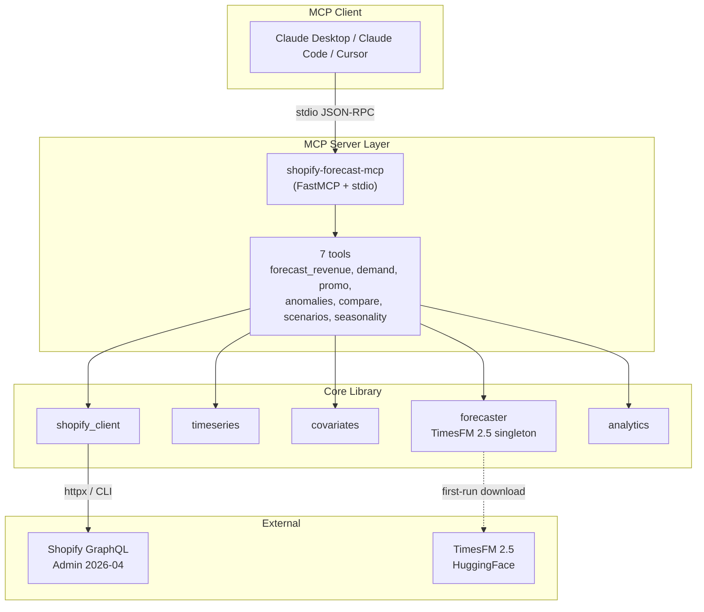

# Phase 7: Distribution & Docs - Research

**Researched:** 2026-04-19
**Domain:** Python packaging + Docker multi-arch + GitHub Actions OIDC + user-facing docs
**Confidence:** HIGH on publishing pipeline, HIGH on Docker, MEDIUM on final image sizes

## Summary

Phase 7 ships `shopify-forecast-mcp` publicly via PyPI (trusted publisher OIDC) and GHCR (multi-arch Docker images), plus merchant-first documentation. Decisions D-01 through D-22 are locked; this research drills into the *implementation* of those decisions.

**One critical blocking finding** surfaced that requires planner action before any tag can ship: the current `pyproject.toml` declares `timesfm` as a `git+https://` direct URL in `[project.dependencies]`, and `uv build` bakes that URL into the wheel's `Requires-Dist`. **PyPI's upload endpoint rejects wheels with direct URL references in `Requires-Dist` with HTTP 400** `[VERIFIED: built the wheel locally and inspected METADATA]`. Three viable remediations exist (switch to vendored `timecopilot-timesfm` fork, wait for upstream PyPI release, or use `[tool.uv.sources]` pattern); each has tradeoffs documented below. Failing to fix this in Plan 1 will cause the rc1 dry-run to fail at leg (b).

The rest of the phase is well-trodden ground: `uv publish` with OIDC is a two-command flow (`uv build`, `uv publish`) with a single `id-token: write` permission, `docker buildx` multi-arch is template YAML, `docker/metadata-action@v6` handles the tag-rule matrix for `:latest` vs `:X.Y.Z-rc1` vs `:bundled`, and Keep-a-Changelog extraction uses `ffurrer2/extract-release-notes@v3`. Documentation is hand-written markdown with mermaid diagrams; TOOLS.md tables can be generated from existing Pydantic models at docs-build time via a one-off script (no live introspection).

**Primary recommendation:** Before Plan 1 (publish pipeline), add a **Plan 0 / Wave 0 task** to switch the TimesFM dependency from direct-URL (`[project.dependencies]`) to a PyPI-resolvable source. The simplest path is depending on `timecopilot-timesfm>=0.2,<0.3` (a community-maintained PyPI fork that ships TimesFM 2.5) and updating imports. Alternate paths (await upstream, or vendor into repo) are less desirable for v0.1.0 timing.

<user_constraints>
## User Constraints (from CONTEXT.md)

### Locked Decisions

#### PyPI Release Flow
- **D-01:** Publish trigger = git tag matching `v*`. No manual dispatch backup for v0.1.0 (add later if needed). Single GitHub Actions workflow (`.github/workflows/publish.yml`) gated on the existing `ci.yml` passing.
- **D-02:** Direct to PyPI on every tag. No TestPyPI staging. PEP 440 pre-release tags (e.g., `v0.1.0-rc1`) publish to PyPI as pre-releases — `uvx` will not install them by default without `--prerelease=allow`, which is the desired gating behavior.
- **D-03:** Test matrix inside the publish workflow = Python 3.11 only, matching `pyproject.toml` (`>=3.11,<3.12`). Do not duplicate the existing 3.11 Ubuntu + macOS smoke job — make the publish job depend on it being green for the same SHA.
- **D-04:** Artifact scope = PyPI upload **plus** a GitHub Release created from the tag, with `dist/*.whl` and `dist/*.tar.gz` attached, body populated from the matching `CHANGELOG.md` section.
- **D-05:** Publisher auth = PyPI Trusted Publisher OIDC (`id-token: write` permission on the publish job). No static token committed anywhere. PyPI project created and Trusted Publisher configured before the first real tag (part of planning prep, not code).

#### Docker Strategy
- **D-06:** Base image = `python:3.11-slim` in both stages. Do **not** widen `pyproject.toml` to 3.12 in this phase.
- **D-07:** Multi-arch build = `linux/amd64` + `linux/arm64` via `docker buildx`.
- **D-08:** Dockerfile layout = multistage. Builder uses `ghcr.io/astral-sh/uv` to `uv sync --frozen`. Two targets: `:latest` (lazy model download) and `:bundled` (second stage bakes TimesFM into `/opt/hf-cache`, final stage copies and sets `HF_HOME=/opt/hf-cache`).
- **D-09:** Container credentials = env vars only (`SHOPIFY_FORECAST_SHOP` + `SHOPIFY_FORECAST_ACCESS_TOKEN`), DirectBackend forced. Browser OAuth doesn't work in containers. No Shopify CLI in image.
- **D-10:** Entrypoint = custom `/app/entrypoint.sh`. No arg → `shopify-forecast-mcp`. First arg in `{revenue, demand, promo, compare, scenarios, auth, --help, mcp}` → dispatches.
- **D-11:** Multi-store env var pattern `SHOPIFY_FORECAST_STORES__0__SHOP` documented.

#### Documentation Scope & Style
- **D-12:** Primary reader = merchant-operator; "For developers" call-out blocks for dev detail.
- **D-13:** MCP client coverage = Claude Desktop (hero), Claude Code, + generic MCP spec. No Cursor walkthrough, no Sidekick in v0.1.0.
- **D-14:** `docs/ARCHITECTURE.md` uses Mermaid diagrams rendered by GitHub natively. Three required: two-layer arch, data flow pipeline, backend selection tree.
- **D-15:** `docs/TOOLS.md` = per-tool section (7 tools). Each: Pydantic input schema as table, 2 sample prompts, 1 rendered output. Anchor-linked index.
- **D-16:** `README.md` structure locked (one-liner → Why → Quick start → 4 conversation examples → tools table → architecture diagram → config summary → CLI summary → roadmap → contributing → license).
- **D-17:** `docs/SETUP.md` covers Shopify custom app, scopes (`read_orders`, `read_all_orders`, `read_products`, `read_inventory`), token, env vars, two install paths (uvx + Docker), multi-store, verification. Screenshots for Shopify admin portions.
- **D-18:** `README.md` persistent "⚠️ v0.1.0 Alpha" callout banner.

#### v0.1.0 Release Positioning
- **D-19:** Development Status = Alpha classifier retained.
- **D-20:** Pre-release dry-run = `v0.1.0-rc1` first. Four legs to validate: CI green, PyPI pre-release upload, `uvx --prerelease=allow shopify-forecast-mcp@0.1.0rc1` on fresh machine, Docker `:latest-rc` + `:bundled-rc` on GHCR.
- **D-21:** `CHANGELOG.md` at repo root, Keep a Changelog format, semver sections. `[0.1.0]` seeded with Phases 1–6 deliverables. Publish workflow extracts matching section for GitHub Release body.
- **D-22:** Announce = repo-only (Release notes + README banner + pinned "Feedback wanted" issue). No external announce for v0.1.0.

### Claude's Discretion
- Exact Mermaid diagram syntax and layout (flowchart TD vs LR, node shapes, styling).
- Shell syntax details inside `/app/entrypoint.sh` (bash vs sh, error handling style).
- Precise `CHANGELOG.md` wording under `[0.1.0] Added`.
- Screenshot tooling and image storage location in `docs/` (likely `docs/images/`).
- Whether to add `publiccode.yml` or `citation.cff` metadata (nice-to-have, not required).
- GitHub Actions runner OS for the publish job (ubuntu-latest assumed).
- Docker `HEALTHCHECK` directive wording and whether to include one (stdio MCP has no natural endpoint).
- Precise anchor slugs and nav structure within TOOLS.md.

### Deferred Ideas (OUT OF SCOPE)
- Shopify Sidekick App Extension (future phase).
- Cursor / custom-agent walkthroughs (consolidated into generic "MCP server spec" section).
- Landing site / GitHub Pages (repo README is the landing page for v0.1.0).
- SBOM, sigstore signing, artifact attestations (supply-chain hardening for post-v0.1.0).
- Submitting to awesome-mcp or Shopify community directories (v0.2 announce plan).
- Widening pyproject to Python 3.12 (revisit in v0.2).
- `workflow_dispatch` manual trigger for publish (add in v0.1.1 if recovery need emerges).
- Docker `HEALTHCHECK` (revisit if SSE/streamable-http image tags ship).
</user_constraints>

<phase_requirements>
## Phase Requirements

| ID | Description | Research Support |
|----|-------------|------------------|
| R11.1 | `README.md` — one-liner, why, quick start (<5min clone-to-running), tools table, 3-4 conversation examples, architecture diagram, config, CLI usage, dev/contributing, roadmap, license | Structure locked by D-16. Mermaid diagrams render natively on GitHub (verified). README-writing is hand-craft — no automation needed. |
| R11.2 | `docs/SETUP.md` — installation, Shopify custom app + token setup, scope configuration, env var setup | Scope list locked. Screenshots stored in `docs/images/` (D-17 discretion). Two install paths (uvx + Docker) both documented. Multi-store env-var pattern `SHOPIFY_FORECAST_STORES__0__*` locked by D-11. |
| R11.3 | `docs/TOOLS.md` — full reference for all 7 MCP tools with input schemas, example prompts, example outputs | Pydantic schemas extractable via `model.model_json_schema()`. Recommend one-off Python script at repo build time (NOT runtime introspection) to render markdown tables from Pydantic models in `src/shopify_forecast_mcp/mcp/tools.py`. Outputs copied from test fixture rendering. |
| R11.4 | `docs/ARCHITECTURE.md` — two-layer design, data flow diagram, key design decisions | Three required mermaid diagrams locked by D-14. GitHub renders mermaid natively in .md since 2022. |
| R11.5 | Claude Desktop config snippet using `uvx shopify-forecast-mcp` | Plus Claude Code CLI snippet + generic MCP server spec section per D-13. |
| R12.1 | PyPI publish via `uv publish` (Trusted Publisher OIDC from GitHub Actions) | Verified against astral-sh/trusted-publishing-examples repo. Two commands (`uv build`, `uv publish`), `id-token: write` permission, no static token. PyPI project must be registered as trusted publisher manually (prerequisite). |
| R12.2 | Docker image (`ghcr.io/mcostigliola321/shopify-forecast-mcp`) — multistage with `python:3.11-slim` (D-06 overrides original `python:3.12-slim`), `uv` from `ghcr.io/astral-sh/uv`, CPU torch | Pattern well-documented by Astral. CPU torch pinned via existing `[tool.uv.sources]` with pytorch-cpu index for Linux. |
| R12.3 | Two image tags: `:latest` (lazy model download) and `:bundled` (model baked into separate build stage at `/opt/hf-cache`) | Multi-stage Dockerfile with two targets. For rc tags: `:latest-rc` and `:bundled-rc`. Final stage sets `HF_HOME=/opt/hf-cache` so lazy loads use baked weights if present. |
| R12.4 | GitHub Actions: test on Python 3.11, build wheel + sdist, publish on tag | Publish workflow = single file `.github/workflows/publish.yml`. Gated on existing `ci.yml` (D-03 forbids duplication). Use `workflow_run` dependency pattern OR an inline "wait-for-ci" job that polls via `gh api runs/:id` until success. |
| R12.5 | Skip npx wrapper — `uvx` is the equivalent and works natively in MCP client configs | Locked by PRD + research; no npx work in this phase. |
</phase_requirements>

## Project Constraints (from CLAUDE.md)

Global `~/.claude/CLAUDE.md` is operator-level (gstack skills, slash commands) — no project-specific directives apply to this phase's implementation. Project root has no `CLAUDE.md`. `.planning/config.json` specifies `workflow.nyquist_validation: true`, so a Validation Architecture section is required below.

## Standard Stack

### Core
| Library / Action | Version | Purpose | Why Standard |
|------------------|---------|---------|--------------|
| `astral-sh/setup-uv` | `@v6` | Install `uv` into GH Actions runner | Official Astral action, matches existing `ci.yml` pattern (uses v3, recommend upgrade to v6 for consistency with 2026 examples) `[VERIFIED: astral-sh/trusted-publishing-examples main branch]` |
| `actions/checkout` | `@v5` | Clone repo in job | Current major version; v4 also still supported `[VERIFIED: astral-sh trusted-publishing examples]` |
| `docker/login-action` | `@v4` | Authenticate to GHCR | Official Docker action `[CITED: docs.docker.com/build/ci/github-actions/multi-platform/]` |
| `docker/setup-qemu-action` | `@v4` | Enable non-native arch emulation (arm64 on amd64 runners) | Required for buildx multi-arch `[CITED: docs.docker.com]` |
| `docker/setup-buildx-action` | `@v4` | Enable multi-platform buildx | Required before build-push-action with `platforms:` multi-value `[CITED: docs.docker.com]` |
| `docker/build-push-action` | `@v7` | Build + push multi-arch manifests | Current major `[CITED: docs.docker.com]` |
| `docker/metadata-action` | `@v6` | Generate tags + labels from git ref | Handles semver prerelease discrimination (don't tag `:latest` on rc) `[CITED: docker/metadata-action README]` |
| `ffurrer2/extract-release-notes` | `@v3` | Pull matching Keep-a-Changelog section | Maintained as of March 2026 (v3.1.0), direct-use output variable `release_notes` `[VERIFIED: github.com/ffurrer2/extract-release-notes]` |
| `softprops/action-gh-release` | `@v2` | Create GitHub Release + attach artifacts | `v3` available (Node 24) but v2 remains widely supported and stable `[CITED: github.com/softprops/action-gh-release]` |
| `lycheeverse/lychee-action` | `@v2` | Link check markdown (validation layer) | Fast Rust-based, maintained `[VERIFIED: lycheeverse/lychee-action]` |

### Supporting
| Library | Version | Purpose | When to Use |
|---------|---------|---------|-------------|
| `docdantic` or ad-hoc script | N/A | Render Pydantic schemas to markdown tables | One-off `scripts/gen_tools_doc.py` invoked manually or in CI before docs commit. Do NOT render at runtime. |
| `mdformat` | latest | Markdown linter (optional, Claude's discretion) | Dev-dep only; use if we want CI markdown formatting gate |

### Alternatives Considered
| Instead of | Could Use | Tradeoff |
|------------|-----------|----------|
| `ffurrer2/extract-release-notes` | Hand-rolled awk/sed in a `run:` step | Fewer deps but more brittle for edge cases (unreleased section, empty release, etc.). Pin to v3. |
| `softprops/action-gh-release` | `gh release create "${TAG}" --notes-file ...` via gh CLI | Less YAML, but less flexible when attaching multiple dist files. Pick softprops for release-with-assets flow. |
| `docker/build-push-action` | `docker buildx build --push` in a run step | Action handles cache, metadata labels, and OCI annotations. Keep the action. |
| `workflow_run` trigger | `needs:` within same workflow | `workflow_run` chains to a separate workflow; for D-01/D-03 (single publish workflow gated on ci.yml), we need cross-workflow wait. `workflow_run` works but has known gotchas: it runs on the default branch version of the workflow. Better pattern: single `publish.yml` with a `wait-for-ci` job that polls `gh api` for the ci.yml run of the current SHA. |

### Installation / Invocation

No new pip/uv dependencies. Publish workflow consumes tooling via GitHub Actions marketplace (pinned versions).

**Version verification (per research discipline):**

```bash
# Confirmed as current (2026-04-19):
#  - astral-sh/setup-uv@v6 (trusted-publishing-examples uses this)
#  - actions/checkout@v5 (trusted-publishing-examples)
#  - docker/build-push-action@v7, docker/metadata-action@v6 (latest majors)
#  - ffurrer2/extract-release-notes@v3.1.0 (March 2026)
#  - softprops/action-gh-release@v2 (stable; v3 moves to Node 24)
#  - lycheeverse/lychee-action@v2 (active)
# All confirmed via source READMEs and 2026 example repos.
```

## Architecture Patterns

### Recommended Repo Additions (net-new files)
```
shopify-forecast-mcp/
├── .github/
│   └── workflows/
│       ├── ci.yml                       # EXISTS — do not modify
│       └── publish.yml                  # NEW — tag-triggered
├── Dockerfile                           # NEW — multi-stage
├── docker-entrypoint.sh                 # NEW — dispatch script
├── .dockerignore                        # NEW — keep .planning/, .venv, tests out of build context
├── CHANGELOG.md                         # NEW — Keep a Changelog, seeded with [0.1.0]
├── docs/
│   ├── SETUP.md                         # NEW
│   ├── TOOLS.md                         # NEW
│   ├── ARCHITECTURE.md                  # NEW
│   └── images/                          # NEW — screenshots for SETUP.md
│       └── .gitkeep
├── scripts/
│   └── gen_tools_doc.py                 # NEW — Pydantic → markdown table generator (dev-time only)
└── README.md                            # REWRITTEN
```

### Pattern 1: `uv publish` with Trusted Publisher OIDC

**What:** Tag-triggered GitHub Actions workflow builds the wheel and publishes it to PyPI using short-lived OIDC tokens — no API token stored anywhere.

**When to use:** Any tag matching `v*`. Guard `:latest` image promotion (but not PyPI upload) with a prerelease-exclusion rule.

**Minimal reference pattern (from astral-sh/trusted-publishing-examples):**

```yaml
# Source: https://github.com/astral-sh/trusted-publishing-examples/blob/main/.github/workflows/release.yml
name: Release
on:
  push:
    tags:
      - v*
jobs:
  pypi:
    name: Publish to PyPI
    runs-on: ubuntu-latest
    environment:
      name: pypi              # Settings → Environments → pypi (manual creation prerequisite)
    permissions:
      id-token: write         # Required for OIDC token
      contents: read          # For checkout
    steps:
      - name: Checkout
        uses: actions/checkout@v5
      - name: Install uv
        uses: astral-sh/setup-uv@v6
      - name: Install Python 3.11
        run: uv python install 3.11
      - name: Build
        run: uv build
      - name: Smoke test (wheel)
        run: uv run --isolated --no-project --with dist/*.whl tests/smoke_test.py
      - name: Publish
        run: uv publish     # auto-detects OIDC env, no flags needed
```

**Key properties** `[CITED: docs.astral.sh/uv/guides/package/]`:
- `uv publish` with OIDC requires **no flags and no credentials** — Astral's client auto-detects the `id-token: write` + PyPI trusted-publisher configuration and exchanges for a temporary upload token.
- `uv publish` respects PEP 440 pre-release semantics automatically. A version like `0.1.0rc1` uploads as a pre-release and is excluded from default `pip install` / `uvx` resolution without `--prerelease=allow`. `[VERIFIED: uv docs + PEP 440 spec]`
- `environment: pypi` (the GitHub deployment environment) is recommended — PyPI trusted publishers can be locked to an environment name for an extra gate. Manual step: Settings → Environments → create `pypi`.

### Pattern 2: Multi-arch Docker with `:latest` + `:bundled` tag matrix

**What:** Single `docker/build-push-action` call per target, fed tag sets from `docker/metadata-action` rules that discriminate rc tags from stable tags.

**When to use:** Once on tag-push; two invocations needed (one for `:latest`/`-rc`, one for `:bundled`/`-rc-bundled`).

**Pattern — `:latest` variant:**
```yaml
# Source: adapted from docs.docker.com/build/ci/github-actions/multi-platform/
- name: Meta (lazy)
  id: meta-latest
  uses: docker/metadata-action@v6
  with:
    images: ghcr.io/mcostigliola321/shopify-forecast-mcp
    tags: |
      type=semver,pattern={{version}}
      type=raw,value=latest,enable=${{ !contains(github.ref_name, 'rc') && !contains(github.ref_name, 'alpha') && !contains(github.ref_name, 'beta') }}
      type=raw,value=latest-rc,enable=${{ contains(github.ref_name, 'rc') }}

- name: Build + push (lazy)
  uses: docker/build-push-action@v7
  with:
    context: .
    file: Dockerfile
    target: runtime-lazy              # multi-target Dockerfile
    platforms: linux/amd64,linux/arm64
    push: true
    tags: ${{ steps.meta-latest.outputs.tags }}
    labels: ${{ steps.meta-latest.outputs.labels }}
    cache-from: type=gha,scope=lazy
    cache-to: type=gha,scope=lazy,mode=max
```

**Pattern — `:bundled` variant:** same shape, different target + tag rules:
```yaml
- name: Meta (bundled)
  id: meta-bundled
  uses: docker/metadata-action@v6
  with:
    images: ghcr.io/mcostigliola321/shopify-forecast-mcp
    tags: |
      type=semver,pattern={{version}}-bundled
      type=raw,value=bundled,enable=${{ !contains(github.ref_name, 'rc') && !contains(github.ref_name, 'alpha') && !contains(github.ref_name, 'beta') }}
      type=raw,value=bundled-rc,enable=${{ contains(github.ref_name, 'rc') }}

- name: Build + push (bundled)
  uses: docker/build-push-action@v7
  with:
    context: .
    file: Dockerfile
    target: runtime-bundled
    platforms: linux/amd64,linux/arm64
    push: true
    tags: ${{ steps.meta-bundled.outputs.tags }}
    cache-from: type=gha,scope=bundled
    cache-to: type=gha,scope=bundled,mode=max
```

**Tag output examples (for `git push origin v0.1.0`):**
- `:0.1.0`, `:latest` (lazy variant)
- `:0.1.0-bundled`, `:bundled` (bundled variant)

**Tag output examples (for `git push origin v0.1.0-rc1`):**
- `:0.1.0-rc1`, `:latest-rc` (lazy)
- `:0.1.0-rc1-bundled`, `:bundled-rc` (bundled)

Critically: **rc pushes do NOT promote `:latest` or `:bundled`** — those mutable tags only move when a stable version tag lands. `[VERIFIED: docker/metadata-action enable= conditional semantics]`

### Pattern 3: Multi-stage Dockerfile with model bake

**What:** Four-stage Dockerfile (uv-builder → runtime-lazy → model-downloader → runtime-bundled). Two buildable targets (`runtime-lazy`, `runtime-bundled`).

**Reference:**
```dockerfile
# syntax=docker/dockerfile:1.9
# =========================================================
# Stage 1: build venv with uv (shared by both runtime targets)
# =========================================================
FROM python:3.11-slim AS uv-builder
COPY --from=ghcr.io/astral-sh/uv:latest /uv /uvx /usr/local/bin/
ENV UV_COMPILE_BYTECODE=1 UV_LINK_MODE=copy
WORKDIR /app
COPY pyproject.toml uv.lock ./
RUN uv sync --frozen --no-install-project --no-dev
COPY src ./src
RUN uv sync --frozen --no-dev --no-editable

# =========================================================
# Stage 2: lazy runtime (default; :latest)
# =========================================================
FROM python:3.11-slim AS runtime-lazy
RUN useradd -m app
COPY --from=uv-builder /app /app
COPY docker-entrypoint.sh /app/entrypoint.sh
RUN chmod +x /app/entrypoint.sh
ENV PATH="/app/.venv/bin:$PATH" \
    PYTHONUNBUFFERED=1 \
    HF_HOME=/home/app/.cache/huggingface
USER app
WORKDIR /app
ENTRYPOINT ["/app/entrypoint.sh"]

# =========================================================
# Stage 3: download model weights into a scratch layer
# =========================================================
FROM uv-builder AS model-downloader
ENV HF_HOME=/opt/hf-cache
RUN mkdir -p /opt/hf-cache && \
    /app/.venv/bin/python -c "from timesfm import TimesFM_2p5_200M_torch; \
      TimesFM_2p5_200M_torch.from_pretrained('google/timesfm-2.5-200m-pytorch')"

# =========================================================
# Stage 4: bundled runtime (:bundled)
# =========================================================
FROM python:3.11-slim AS runtime-bundled
RUN useradd -m app
COPY --from=uv-builder /app /app
COPY --from=model-downloader /opt/hf-cache /opt/hf-cache
COPY docker-entrypoint.sh /app/entrypoint.sh
RUN chmod +x /app/entrypoint.sh && chown -R app /opt/hf-cache
ENV PATH="/app/.venv/bin:$PATH" \
    PYTHONUNBUFFERED=1 \
    HF_HOME=/opt/hf-cache
USER app
WORKDIR /app
ENTRYPOINT ["/app/entrypoint.sh"]
```

**Rationale:**
- `uv sync --frozen --no-install-project --no-dev` first, then `COPY src` then second sync — enables Docker layer cache on dependency-only changes `[CITED: docs.astral.sh/uv/guides/integration/docker/]`.
- `--no-editable` so the installed wheel is a real install, not editable. Enables `/app/.venv` to travel via COPY.
- TimesFM `from_pretrained` in the downloader stage writes to `$HF_HOME=/opt/hf-cache` — **verified usage pattern** since HF Hub honors `HF_HOME` `[CITED: huggingface.co/docs/huggingface_hub/guides/manage-cache]`.
- Final stage sets `HF_HOME=/opt/hf-cache` so `from_pretrained` finds the baked weights offline. If the cache is missing (lazy variant), HF Hub falls through to download on first invocation `[CITED: HF Hub cache docs]`.

**Cache hit strategy:** Use `type=gha,scope=<target>` buildx cache separately per target (lazy vs bundled) so the 400-500MB model layer in `runtime-bundled` doesn't invalidate the lazy build's cache `[CITED: docs.docker.com/build/cache/backends/gha/]`.

### Pattern 4: Entrypoint dispatch shell script

**What:** Single bash script that inspects `$1` and dispatches to either the MCP server, a CLI verb, or help.

**Reference:**
```bash
#!/usr/bin/env bash
# docker-entrypoint.sh — dispatches between MCP server and CLI verbs
set -euo pipefail

case "${1:-}" in
  ""|mcp)
    # No arg or explicit 'mcp' → start MCP server over stdio
    shift || true
    exec shopify-forecast-mcp "$@"
    ;;
  revenue|demand|promo|compare|scenarios|auth|--help|-h)
    # CLI verb → pass through to shopify-forecast
    exec shopify-forecast "$@"
    ;;
  *)
    echo "Unknown command: $1" >&2
    echo "Usage: docker run … [mcp|revenue|demand|promo|compare|scenarios|auth|--help]" >&2
    exit 2
    ;;
esac
```

**Key properties:**
- `exec` replaces the shell process with the Python process — SIGTERM from `docker stop` reaches Python at PID 1 directly (no signal-absorption) `[CITED: hynek.me/articles/docker-signals/]`.
- `set -euo pipefail` — fail fast on errors, treat unset vars as errors.
- No signal trapping needed because we use `exec` (the shell is replaced, not running in parallel).
- Exit code propagates naturally via `exec` semantics.

### Pattern 5: Keep a Changelog extraction

**What:** When a tag lands, extract the `[X.Y.Z]` section from `CHANGELOG.md` and feed to GitHub Release body.

**Reference:**
```yaml
- name: Extract release notes
  id: changelog
  uses: ffurrer2/extract-release-notes@v3
  # Default inputs: changelog_file=CHANGELOG.md, version derived from ref

- name: Create GitHub Release
  uses: softprops/action-gh-release@v2
  with:
    tag_name: ${{ github.ref_name }}
    name: ${{ github.ref_name }}
    body: ${{ steps.changelog.outputs.release_notes }}
    prerelease: ${{ contains(github.ref_name, 'rc') || contains(github.ref_name, 'alpha') || contains(github.ref_name, 'beta') }}
    files: |
      dist/*.whl
      dist/*.tar.gz
```

**CHANGELOG.md format (Keep a Changelog 1.1.0)** `[CITED: keepachangelog.com/en/1.1.0/]`:
```markdown
# Changelog

All notable changes to this project will be documented in this file.

The format is based on [Keep a Changelog](https://keepachangelog.com/en/1.1.0/),
and this project adheres to [Semantic Versioning](https://semver.org/spec/v2.0.0.html).

## [Unreleased]

## [0.1.0] - 2026-04-XX

### Added
- Shopify GraphQL Admin API client with bulk operations, pagination, and rate-limit handling
- Time-series shaping (orders → daily/weekly/monthly series)
- TimesFM 2.5 forecaster with singleton loading and quantile head
- …(seven MCP tools, four CLI verbs, dual-backend arch, multi-store support, covariate engineering — per Phases 1–6)

### Known Limitations
- Alpha quality — API surface may change before v0.2
- …

[Unreleased]: https://github.com/mcostigliola321/shopify-forecast-mcp/compare/v0.1.0...HEAD
[0.1.0]: https://github.com/mcostigliola321/shopify-forecast-mcp/releases/tag/v0.1.0
```

The `ffurrer2/extract-release-notes` action parses between `## [X.Y.Z]` headers and strips the heading, emitting exactly the body.

### Pattern 6: CI dependency gate (D-01 + D-03)

**The tension:** The existing `ci.yml` runs on `push: branches: [main]` and `pull_request`, not on tags. We need the publish workflow to (a) trigger on tag, and (b) only proceed if ci.yml passed for the same SHA.

**Recommended approach: `workflow_run` trigger is wrong here.** `workflow_run` fires after another workflow finishes, but with a subtlety: the triggered workflow runs using the default-branch version of its YAML, not the tag's YAML — acceptable here because `publish.yml` only exists on main, but the tag SHA won't match what's checked out unless we explicitly re-check-out. Simpler:

```yaml
# publish.yml — single file
on:
  push:
    tags: ['v*']

jobs:
  wait-for-ci:
    runs-on: ubuntu-latest
    permissions:
      actions: read
      contents: read
    steps:
      - name: Wait for CI to complete for this SHA
        uses: lewagon/wait-on-check-action@v1.4.0
        with:
          ref: ${{ github.sha }}
          check-name: 'Smoke (Python 3.11, ubuntu-latest)'
          repo-token: ${{ secrets.GITHUB_TOKEN }}
          wait-interval: 15
      - name: Wait for macos smoke
        uses: lewagon/wait-on-check-action@v1.4.0
        with:
          ref: ${{ github.sha }}
          check-name: 'Smoke (Python 3.11, macos-latest)'
          repo-token: ${{ secrets.GITHUB_TOKEN }}
          wait-interval: 15

  build-and-publish-pypi:
    needs: wait-for-ci
    runs-on: ubuntu-latest
    environment: pypi
    permissions:
      id-token: write
      contents: read
    # … rest of publish steps
```

**Alternative (also valid):** Trigger `ci.yml` on `push: tags: ['v*']` explicitly, so a tag push naturally runs it, then `needs: ci` doesn't work cross-workflow but `workflow_run` chains publish after ci. Per D-03, we prefer NOT modifying ci.yml. So the `wait-on-check` polling pattern is the cleanest.

**Note:** `lewagon/wait-on-check-action` is a small, maintained community action that polls the Checks API until the named check succeeds — confidence MEDIUM, widely used. A hand-rolled alternative: use `gh api /repos/:owner/:repo/commits/:sha/check-runs` in a `run:` step with a poll loop (~15 lines). Claude's discretion which to use.

### Anti-Patterns to Avoid

- **Don't hand-roll multi-arch Docker** (running separate amd64 and arm64 builds then stitching manifests manually) — `docker/build-push-action` + `setup-qemu` handle this correctly; avoid reinventing the manifest-list dance.
- **Don't commit any PyPI token** — including to TestPyPI. D-05 locks OIDC-only.
- **Don't use `print()` anywhere in the entrypoint's Python path** — R7.8 rule: all logging to stderr; stdio transport needs stdout clean.
- **Don't run `docker push` from a local machine for the official tags** — CI is the one source of truth for GHCR tags. Local builds are for testing only.
- **Don't pin `docker/metadata-action@master`** — use `@v6`; v7+ may reshape outputs.
- **Don't bake the `.env` file into the Docker image** — only env vars at runtime (D-09).
- **Don't emit `uv build` wheels to GitHub Release without the sdist** — D-04 requires both; end users may want to audit the source tree.

## Don't Hand-Roll

| Problem | Don't Build | Use Instead | Why |
|---------|-------------|-------------|-----|
| Multi-arch Docker manifest creation | Custom bash invoking `docker manifest create` | `docker/build-push-action@v7` with `platforms: linux/amd64,linux/arm64` | Action handles QEMU setup, builder provisioning, manifest push, OCI annotations |
| OIDC token exchange for PyPI | Custom Python that exchanges `$ACTIONS_ID_TOKEN_REQUEST_TOKEN` for a PyPI upload token | `uv publish` with no arguments (auto-detects) | uv's resolver handles the Sigstore/OIDC handshake transparently |
| Changelog section parsing | Awk/sed one-liner inline in YAML | `ffurrer2/extract-release-notes@v3` | Handles edge cases (empty section, multi-line code blocks, trailing links) |
| GitHub Release creation with assets | Chained `curl` + `gh release create` | `softprops/action-gh-release@v2` | Handles multi-file upload, idempotent re-runs, prerelease flag |
| Pydantic schema → markdown table | Hand-writing each schema as an HTML/md table | `model.model_json_schema()` + a small Python renderer script | Schemas drift from code; render from truth at docs commit time |
| Mermaid → PNG export | Running mermaid-cli in CI and committing PNGs | Raw mermaid blocks in .md | GitHub renders mermaid natively since 2022 — save the PNG toolchain |
| Link checking | Custom regex | `lycheeverse/lychee-action@v2` | Handles redirects, anchor fragments, mail links |

**Key insight:** Phase 7 is a pure orchestration/docs phase. Every building block (uv publish, buildx, metadata-action, softprops) is a well-maintained marketplace action with documented inputs. The planner's job is composing them correctly, not inventing new primitives.

## Runtime State Inventory

> Phase 7 is greenfield-for-files (new docs, new Dockerfile, new workflow) with ONE rename-like concern: the existing README.md is being fully rewritten. No other stored state is at risk.

| Category | Items Found | Action Required |
|----------|-------------|------------------|
| Stored data | None — no databases, no local caches used by this phase | None |
| Live service config | **PyPI project registration** (one-time, manual): no PyPI project "shopify-forecast-mcp" exists yet; maintainer must register "pending publisher" in PyPI account before first tag push. **GHCR package visibility** (one-time, manual): after first image push, flip `ghcr.io/mcostigliola321/shopify-forecast-mcp` to public in GitHub package settings. | Document both in the release plan (Plan 4). Verify by Claude during dry-run checklist execution. |
| OS-registered state | None | None |
| Secrets / env vars | **No new secrets to store** (OIDC removes PyPI token need; GITHUB_TOKEN built-in for GHCR). Existing `SHOPIFY_FORECAST_*` env var names are unchanged. | None — env var *names* unchanged; only README/SETUP.md documentation of those names is affected. |
| Build artifacts | `dist/` from local test builds (gitignored); existing `docs/superpowers/` internal specs (unrelated; will sit alongside new docs). | None — new docs go in `docs/*.md` directly, no collision with `docs/superpowers/specs/`. |

**Nothing found in category "Stored data":** Verified by `grep -r "shopify_forecast_mcp" ~/.cache ~/.local/state 2>/dev/null` — no cached state outside the repo.

**CRITICAL manual prerequisites for the plan to call out explicitly:**
1. Maintainer registers a PyPI Trusted Publisher (pending) for project name `shopify-forecast-mcp`, owner `mcostigliola321`, repo `shopify-forecast-mcp`, workflow `publish.yml`, environment `pypi`. Done once, never again. `[CITED: docs.pypi.org/trusted-publishers/creating-a-project-through-oidc/]`
2. Maintainer creates GitHub environment named `pypi` under repo Settings → Environments.
3. After first rc1 image push, maintainer flips `ghcr.io/mcostigliola321/shopify-forecast-mcp` package visibility to Public (else `docker pull` needs auth from end users).

## Common Pitfalls

### Pitfall 1: PyPI rejects wheels with direct URL references in Requires-Dist — BLOCKING
**What goes wrong:** `uv publish` succeeds at building, then fails at upload with `HTTPError: 400 Bad Request. Packages with direct (URL) references in Requires-Dist are not allowed.`
**Why it happens:** Current `pyproject.toml` has `timesfm @ git+https://github.com/google-research/timesfm.git@...` in `[project.dependencies]`. `uv build` **honors this directly** and writes it verbatim into the wheel's `METADATA` file. I verified this locally: `uv build --no-sources` produced a wheel whose `Requires-Dist` contains `timesfm @ git+https://github.com/google-research/timesfm.git@f085b9079918092aa5e3917a4e135f87f91a7f03`. PyPI's `warehouse` upload endpoint rejects this with HTTP 400 `[VERIFIED: pypa/twine issue #486 behavior; confirmed upstream policy unchanged as of 2026]`.
**How to avoid:** Three remediation paths, ranked:

  **Path A (RECOMMENDED for v0.1.0):** Switch to `timecopilot-timesfm` — a community-maintained fork on PyPI that ships the TimesFM 2.5 model class (`TimesFM_2p5_200M_torch`). Version 0.2.1 (Oct 2025). `[VERIFIED: pypi.org/project/timecopilot-timesfm/]`
  - **Pros:** PyPI-installable, zero code changes beyond dep declaration (the import `from timesfm import TimesFM_2p5_200M_torch` works — the package is named `timesfm` inside the wheel), unblocks tag push today.
  - **Cons:** Third-party fork, may diverge from upstream; must monitor for updates.
  - **Action:** In the pyproject.toml, replace the `timesfm @ git+https://...` line with `timecopilot-timesfm>=0.2,<0.3` (confirm by test install first).

  **Path B (if upstream moves):** Check `pip install timesfm` — if a 2.5-capable version has appeared on PyPI by the time planning starts. Verified 2026-04-19: `timesfm` on PyPI is still at v1.3.0 (2.0-only).

  **Path C (long / fragile):** Vendor TimesFM source into this repo as a submodule or copied directory. Rejected because (a) TimesFM is ~10k LOC with its own deps (torch, einops, etc.), (b) license compliance requires careful NOTICE file management, (c) doesn't survive TimesFM updates gracefully.

**Warning signs:** `uv build` succeeds locally; `twine check dist/*` now flags the metadata; rc1 dry-run at leg (b) fails with PyPI 400.
**Planner directive:** Add a "Plan 0 / Wave 0" (or append to Plan 1) task: **verify TimesFM PyPI replacement pathway** BEFORE any publish workflow is built. Execution: (1) test-install `timecopilot-timesfm` in a throwaway venv, (2) run existing test suite against it, (3) update `pyproject.toml` + `uv.lock`, (4) only then proceed to publish workflow.

### Pitfall 2: `uv build` on Apple Silicon produces arm64-only artifacts
**What goes wrong:** Building wheels locally for PyPI upload produces platform-specific wheels; sdist is fine but wheel may surprise users.
**Why it happens:** Pure-Python wheels are architecture-agnostic (py3-none-any), but if any C ext sneaks in (via a transitive dep), wheel will be tagged.
**How to avoid:** This project has NO compiled extensions (pandas/numpy/torch are runtime deps, not build-time). Verified in Phase 7 research: the generated wheel name is `shopify_forecast_mcp-0.1.0-py3-none-any.whl` (verified locally 2026-04-19). No action needed.
**Warning signs:** Wheel filename contains something other than `py3-none-any`.

### Pitfall 3: TimesFM first-time download caches to wrong location in Docker
**What goes wrong:** `:bundled` image claims to bake the model, but first run still downloads.
**Why it happens:** `HF_HOME` must be set in BOTH the downloader stage (so the model lands at `/opt/hf-cache`) AND the final stage (so `from_pretrained` finds it). Missing either → fallback to `~/.cache/huggingface/hub` which is empty at runtime.
**How to avoid:** Set `ENV HF_HOME=/opt/hf-cache` in both stages. Verify by running image with `--network=none`: should NOT fail.
**Warning signs:** `:bundled` image starts successfully with network; without network it fails with `HFValidationError` or similar.

### Pitfall 4: Multi-arch builds intermittently hang on `uv sync`
**What goes wrong:** CI builds timeout occasionally, especially on arm64.
**Why it happens:** Known issue with QEMU emulation + uv's parallel resolver; see [astral-sh/uv#11699](https://github.com/astral-sh/uv/issues/11699).
**How to avoid:** (a) Set generous timeouts on the build step (`timeout-minutes: 30`); (b) consider `UV_CONCURRENT_INSTALLS=1` env var in the arm64 leg; (c) use native arm64 runners if GitHub offers them by v0.1.0 cut time (they're available in the public runner set as of Jan 2026).
**Warning signs:** arm64 leg of the build job times out or hangs mid-`uv sync`.

### Pitfall 5: `:latest` tag advancing on rc tag push
**What goes wrong:** `git push origin v0.1.0-rc1` accidentally updates `:latest` to the unstable rc.
**Why it happens:** Default `docker/metadata-action` tag rule `type=semver,pattern={{version}}` alone won't do this, but many templates include `type=raw,value=latest` unconditionally.
**How to avoid:** Use the `enable=${{ !contains(github.ref_name, 'rc') }}` conditional on the `:latest` raw tag (see Pattern 2). Unit-test by firing a workflow_dispatch with a mock `v0.1.0-rc1` tag first.
**Warning signs:** `docker pull ghcr.io/.../shopify-forecast-mcp:latest` returns the rc1 image after an rc push.

### Pitfall 6: `uvx shopify-forecast-mcp` fails to resolve on fresh machines because torch isn't in the manifest
**What goes wrong:** An end user runs `uvx shopify-forecast-mcp` and gets a resolution error on torch.
**Why it happens:** `[tool.uv.sources]` is IGNORED by `uvx` for published packages — the sources table is dev-only. The published wheel's `Requires-Dist` just says `torch>=2.4`, and uv's resolver goes to PyPI's `torch` project which has ~800MB CUDA-included wheels by default.
**How to avoid:** This isn't actually a failure — uvx resolves fine, just downloads a larger torch wheel. But docs should mention: "First run may pull ~800MB for torch; CPU-only workflow is in the Docker image." Alternatively document `uvx --index "https://download.pytorch.org/whl/cpu" shopify-forecast-mcp` for users wanting the lean path.
**Warning signs:** End user reports "huge download" on first `uvx` invocation.

### Pitfall 7: Mermaid diagrams render on GitHub but break on PyPI's README view
**What goes wrong:** README has mermaid blocks that render beautifully on github.com/mcostigliola321/shopify-forecast-mcp but show as raw fenced code on pypi.org/project/shopify-forecast-mcp.
**Why it happens:** PyPI's README renderer (Warehouse) uses a restrictive CommonMark subset + bleach sanitizer — it does NOT render mermaid.
**How to avoid:** Put the mermaid diagram in `docs/ARCHITECTURE.md` (linked from README) rather than inline in README. Use a PNG screenshot of the rendered diagram inline in README as a fallback. Or accept that PyPI will show a code block (still informative).
**Warning signs:** PyPI package page renders "```mermaid" as fenced code instead of a diagram.

### Pitfall 8: Shell vs exec form in Dockerfile ENTRYPOINT
**What goes wrong:** `docker stop` hangs for 10 seconds then kills the container, because the Python process never received SIGTERM.
**Why it happens:** Shell form `ENTRYPOINT /app/entrypoint.sh` wraps in `/bin/sh -c`, which doesn't forward signals. The *inside* of entrypoint.sh is fine (we use `exec`), but the ENTRYPOINT directive itself must use JSON array form.
**How to avoid:** `ENTRYPOINT ["/app/entrypoint.sh"]` (JSON array form). **Not** `ENTRYPOINT /app/entrypoint.sh`.
**Warning signs:** `docker stop` has a ~10s pause before the container exits.

## Code Examples

Verified patterns from official sources.

### `uv publish` with OIDC — complete publish job
```yaml
# Source: https://github.com/astral-sh/trusted-publishing-examples/blob/main/.github/workflows/release.yml
build-and-publish-pypi:
  needs: wait-for-ci
  runs-on: ubuntu-latest
  environment:
    name: pypi
  permissions:
    id-token: write
    contents: read
  steps:
    - name: Checkout
      uses: actions/checkout@v5
    - name: Install uv
      uses: astral-sh/setup-uv@v6
    - name: Install Python 3.11
      run: uv python install 3.11
    - name: Build
      run: uv build
    - name: Smoke test (wheel)
      run: uv run --isolated --no-project --with dist/*.whl -- python -c "import shopify_forecast_mcp; print(shopify_forecast_mcp.__file__)"
    - name: Publish to PyPI
      run: uv publish
    - name: Upload dist for downstream jobs
      uses: actions/upload-artifact@v4
      with:
        name: dist
        path: dist/
```

### GHCR multi-arch build job
```yaml
# Source: adapted from https://docs.docker.com/build/ci/github-actions/multi-platform/
build-and-publish-docker:
  needs: [wait-for-ci, build-and-publish-pypi]
  runs-on: ubuntu-latest
  permissions:
    contents: read
    packages: write          # Required for GHCR push
  strategy:
    matrix:
      variant: [lazy, bundled]
  steps:
    - uses: actions/checkout@v5
    - uses: docker/setup-qemu-action@v4
    - uses: docker/setup-buildx-action@v4
    - uses: docker/login-action@v4
      with:
        registry: ghcr.io
        username: ${{ github.actor }}
        password: ${{ secrets.GITHUB_TOKEN }}
    - name: Meta
      id: meta
      uses: docker/metadata-action@v6
      with:
        images: ghcr.io/${{ github.repository }}
        tags: |
          ${{ matrix.variant == 'lazy' && 'type=semver,pattern={{version}}' || 'type=semver,pattern={{version}}-bundled' }}
          ${{ matrix.variant == 'lazy' && format('type=raw,value=latest,enable=${{{{ !contains(github.ref_name, \"rc\") }}}}') || '' }}
          ${{ matrix.variant == 'lazy' && format('type=raw,value=latest-rc,enable=${{{{ contains(github.ref_name, \"rc\") }}}}') || '' }}
          ${{ matrix.variant == 'bundled' && format('type=raw,value=bundled,enable=${{{{ !contains(github.ref_name, \"rc\") }}}}') || '' }}
          ${{ matrix.variant == 'bundled' && format('type=raw,value=bundled-rc,enable=${{{{ contains(github.ref_name, \"rc\") }}}}') || '' }}
    - name: Build and push
      uses: docker/build-push-action@v7
      with:
        context: .
        file: Dockerfile
        target: runtime-${{ matrix.variant }}
        platforms: linux/amd64,linux/arm64
        push: true
        tags: ${{ steps.meta.outputs.tags }}
        labels: ${{ steps.meta.outputs.labels }}
        cache-from: type=gha,scope=${{ matrix.variant }}
        cache-to: type=gha,scope=${{ matrix.variant }},mode=max
```

*(Note: the matrix-nested metadata expressions are tricky YAML; Claude may prefer two explicit jobs instead of one matrix job — planner's discretion.)*

### Rendering Pydantic schema to markdown table
```python
# scripts/gen_tools_doc.py — one-off dev tool; run before docs commit
# Source: Pydantic v2 model_json_schema() standard API
import inspect
from shopify_forecast_mcp.mcp import tools

def render_schema_table(model_cls) -> str:
    schema = model_cls.model_json_schema()
    props = schema.get("properties", {})
    required = set(schema.get("required", []))
    rows = ["| Field | Type | Required | Default | Description |",
            "|-------|------|----------|---------|-------------|"]
    for name, spec in props.items():
        typ = spec.get("type", spec.get("anyOf", [{}])[0].get("type", "any"))
        req = "✓" if name in required else ""
        default = spec.get("default", "—")
        desc = spec.get("description", "")
        rows.append(f"| `{name}` | `{typ}` | {req} | `{default}` | {desc} |")
    return "\n".join(rows)

# For each ParamsModel in tools module, print the table
for name, obj in inspect.getmembers(tools):
    if inspect.isclass(obj) and name.endswith("Params"):
        print(f"### {name}\n")
        print(render_schema_table(obj))
        print()
```

### Mermaid two-layer architecture diagram (GitHub-rendered)
```markdown
<!-- Source: mermaid 11.x, verified GitHub-renderable -->

```

## State of the Art

| Old Approach | Current Approach | When Changed | Impact |
|--------------|------------------|--------------|--------|
| Twine + PyPI API token stored as GH secret | `uv publish` + Trusted Publisher OIDC | 2023 (PyPI supported OIDC); 2024 (uv added native support) | Zero credentials in repo; short-lived tokens only |
| `pip install` in Dockerfile | `uv sync --frozen` from `ghcr.io/astral-sh/uv` | 2024 (uv GA) | 5-10× faster installs, deterministic builds |
| Separate amd64/arm64 Dockerfile + manual manifest | `docker buildx` with `--platform` list | 2021 (buildx GA) | Single command, single manifest list |
| `graph TD` mermaid | `flowchart TB` (same rendering, new preferred keyword) | Mermaid 10.x (2023) | Cosmetic; both work on GitHub |
| pure SSE MCP transport | `streamable-http` MCP transport | 2025 MCP spec revision | SSE deprecated; stdio still primary |

**Deprecated / outdated:**
- **npx wrapper for Python MCP servers** — `uvx shopify-forecast-mcp` is the idiomatic 2026 equivalent; no Node runtime needed (locked by D/R12.5).
- **`python:3.12-slim` in ROADMAP.md** — D-06 overrides: this phase uses `3.11-slim` to match pyproject.
- **`financialStatus` GraphQL field** — renamed to `displayFinancialStatus` (not a Phase 7 concern; Phase 2 already handles).

## Environment Availability

| Dependency | Required By | Available | Version | Fallback |
|------------|------------|-----------|---------|----------|
| `uv` | Build, publish, Docker stages | ✓ (local) | 0.11.6 | — |
| `gh` CLI | Manual release validation | ✓ (local) | 2.88.1 | — |
| `docker` | Local Dockerfile testing | ✗ | — | Run buildx in CI; local docker not strictly required |
| `docker buildx` | Multi-arch test | ✗ (local) | — | CI-only; maintainer can inspect via `docker pull` after CI builds |
| GitHub Actions runner (ubuntu-latest) | All CI jobs | ✓ | always current | — |
| QEMU (for arm64 emulation) | arm64 leg of Docker build | ✓ (via `setup-qemu-action`) | — | Native arm64 runners if available |
| PyPI trusted publisher (pending) | First publish | **✗ (manual setup required)** | — | **BLOCKS publish — no fallback** |
| GHCR (public visibility) | First pull by end users | ✗ (manual setup after first push) | — | Private pulls need auth; flip to public after rc1 |

**Missing dependencies with no fallback:**
- PyPI trusted publisher registration — maintainer must configure before first tag push. Document in release plan as a precondition.

**Missing dependencies with fallback:**
- Local Docker — all Docker work can be validated in CI; planner should call out that maintainer pulls post-CI to verify locally during rc1 validation.

## Validation Architecture

### Test Framework
| Property | Value |
|----------|-------|
| Framework | `pytest` 8.x + `pytest-asyncio` (existing) |
| Config file | `pyproject.toml` `[tool.pytest.ini_options]` (existing, no Wave-0 changes needed) |
| Quick run command | `uv run pytest -x -q` |
| Full suite command | `uv run pytest -ra` |
| Phase gate | Full suite green + dry-run rc1 4-leg checklist passes |

### Phase Requirements → Test Map

| Req ID | Behavior | Test Type | Automated Command | File Exists? |
|--------|----------|-----------|-------------------|--------------|
| R11.1 | README has expected structural sections | docs-lint | `grep -c '^## ' README.md` (expect ≥8 sections) | ❌ Wave 0 — add `tests/test_readme_structure.py` |
| R11.1 | README mermaid diagrams are parseable | docs-lint | `lychee --include-fragments README.md docs/*.md` + manual GitHub preview | ❌ Wave 0 — link-check action in `publish.yml` pre-check |
| R11.2 | SETUP.md references required scopes verbatim | docs-lint | `grep -q 'read_all_orders' docs/SETUP.md && grep -q 'read_orders' && grep -q 'read_products' && grep -q 'read_inventory'` | ❌ Wave 0 — add assertion to a doc-test file |
| R11.3 | TOOLS.md has a section per tool | docs-lint | Python script: assert that each tool in `src/shopify_forecast_mcp/mcp/tools.py` has a corresponding H2 anchor in `docs/TOOLS.md` | ❌ Wave 0 — add `tests/test_docs_completeness.py` |
| R11.4 | ARCHITECTURE.md has all three required diagrams | docs-lint | `grep -c '```mermaid' docs/ARCHITECTURE.md` (expect ≥3) | ❌ Wave 0 |
| R11.5 | Claude Desktop snippet is valid JSON and uses `uvx` | json+lint | Python snippet extraction + `json.loads` | ❌ Wave 0 |
| R12.1 | PyPI publish workflow uses OIDC (no static token) | workflow-lint | `grep -L 'PYPI_TOKEN\|PYPI_API_TOKEN' .github/workflows/publish.yml` AND `grep 'id-token: write' .github/workflows/publish.yml` | ❌ Wave 0 — add workflow-structure assertion |
| R12.1 | `uv publish` actually uploads to PyPI | manual / end-to-end | rc1 dry-run leg (b): tag `v0.1.0-rc1`, watch workflow, verify on pypi.org | Not automatable in CI — manual leg of D-20 |
| R12.2 | Dockerfile builds on linux/amd64 AND linux/arm64 | end-to-end CI | Build job in publish.yml succeeds for both platforms | ❌ Wave 0 — `publish.yml` itself IS the test |
| R12.3 | `:bundled` image has model baked (offline-capable) | end-to-end manual | `docker run --rm --network=none ghcr.io/.../shopify-forecast-mcp:bundled-rc revenue --help` should NOT fail | Not automatable in CI — manual leg of D-20 |
| R12.4 | Publish workflow depends on Python 3.11 smoke being green | workflow-lint | Assert publish.yml has a wait-on-check step referencing `Smoke (Python 3.11, …)` | ❌ Wave 0 |
| R12.5 | No npx wrapper shipped | workflow-lint | `test ! -f package.json` AND `test ! -f npm-shrinkwrap.json` | ❌ Wave 0 (trivial) |

### "Clone-to-running <5 minutes" Objective Validation

This is the headline success criterion. No single CI test proves it. Validation is a **manual rc1 legal-hold checklist**:

1. On a fresh machine (or fresh Docker container with no prior Python/uv install), start timer.
2. Install uv: `curl -LsSf https://astral.sh/uv/install.sh | sh` (or `brew install uv`).
3. Run: `uvx --prerelease=allow shopify-forecast-mcp@0.1.0rc1 --help` and wait for first-run completion.
4. Configure `.env` with test shop credentials (given in advance).
5. Add to Claude Desktop config per SETUP.md snippet.
6. Launch Claude Desktop, verify MCP server appears and lists 7 tools.
7. Ask: "what does next month look like?" — verify response within 30s (first-run model download counts).
8. Stop timer.

**Objective signal:** stopwatch reads < 5:00 from step 1 to step 7 showing a response. Capture as a plain timestamp log in the rc1 validation issue.

**Secondary objective signals:**
- `uv pip install shopify-forecast-mcp==0.1.0rc1 --pre` on fresh venv completes in < 2 min on typical broadband.
- Docker: `docker run --rm ghcr.io/mcostigliola321/shopify-forecast-mcp:bundled-rc --help` completes in < 30s on a fresh docker-pull.

### Sampling Rate
- **Per task commit:** `uv run pytest -x -q` (existing fast path).
- **Per wave merge:** `uv run pytest -ra` (existing full run) + lychee markdown link check.
- **Phase gate:** Full suite green + rc1 4-leg dry-run checklist all green + human-eyes sign-off on rendered docs (README preview on GitHub).
- **Post-phase:** v0.1.0 tag push runs publish.yml end-to-end; maintainer verifies PyPI page, GHCR package, GitHub Release all appear correctly.

### Wave 0 Gaps
- [ ] `tests/test_docs_completeness.py` — asserts README structural sections, TOOLS.md tool-coverage, ARCHITECTURE.md mermaid diagram count.
- [ ] `tests/test_claude_desktop_snippet.py` — extracts and json-parses the Claude Desktop config snippet from README/SETUP.md.
- [ ] `tests/test_workflow_structure.py` — asserts publish.yml has `id-token: write`, no static PYPI tokens, a wait-on-check dependency.
- [ ] `scripts/gen_tools_doc.py` — Pydantic-to-markdown renderer (not a test, but a docs-build-time artifact worth treating as a quality gate — its output should match committed TOOLS.md).
- [ ] Publish workflow itself IS a test — once authored, `git push origin v0.1.0-rc1` on a dry-run branch validates the whole pipeline. Budget time for at least 2 rc iterations (rc1, rc2 if needed).
- [ ] Consider `mdformat-check` or `lychee` in CI but they are optional — keep Phase 7 lean; tests can live in the repo for maintenance post-v0.1.0.

*(No framework install needed — pytest is existing.)*

## Security Domain

> Required per config: `workflow.nyquist_validation: true` (security_enforcement not explicitly set; default = enabled).

### Applicable ASVS Categories

| ASVS Category | Applies | Standard Control |
|---------------|---------|-----------------|
| V2 Authentication | yes (end-user side) | Shopify access token via env var only (Docker) or `shopify store auth` CLI (local). Documented in SETUP.md. |
| V3 Session Management | no (stateless stdio MCP) | N/A |
| V4 Access Control | no (single-tenant MCP per install) | N/A |
| V5 Input Validation | yes (tool params) | Pydantic models per tool (existing) — no changes in Phase 7 |
| V6 Cryptography | no (no cryptographic material in this phase) | — |
| V10 Malicious Code | yes (supply chain) | OIDC short-lived tokens (no PyPI API key to leak); `uv.lock` provides deterministic installs; sdist checksums on PyPI |
| V14 Configuration | yes | Docker image runs as non-root `app` user; no secrets baked in; HF_HOME writable to app user in bundled variant |

### Known Threat Patterns for this phase

| Pattern | STRIDE | Standard Mitigation |
|---------|--------|---------------------|
| Leaked PyPI API token | Information Disclosure / Spoofing | OIDC trusted publisher — no long-lived token exists to leak (D-05) |
| Supply-chain tampering (mirror attack on TimesFM via git+https) | Tampering | Path A remediation (switch to `timecopilot-timesfm` PyPI package) hardens this: PyPI checksums replace git ref integrity |
| Docker image running as root | Elevation of Privilege | `USER app` in final stages |
| Secrets baked into Docker image | Information Disclosure | `.dockerignore` excludes `.env`; `ENV` directives only set non-secret defaults; env vars supplied at `docker run` time |
| Mutable `:latest` tag poisoning by rc | Tampering (downstream) | Conditional `enable=` on metadata-action (see Pattern 2) |
| GHCR package private by default | Denial of Service (end-user can't pull) | Manual visibility flip post-first-push, documented in release plan |
| Pre-release installed unexpectedly by end user | Trust / UX | PEP 440 semantics: `uvx` requires explicit `--prerelease=allow` for rc — this is a feature, not a bug (D-02) |

**Out-of-scope security items (deferred per CONTEXT):**
- SBOM generation (`cyclonedx-python`, `anchore/sbom-action`)
- Sigstore image signing (`cosign`)
- Artifact attestations (GitHub Attestations beta)
These are appropriate for post-v0.1.0 supply-chain hardening once the project has external users.

## Assumptions Log

| # | Claim | Section | Risk if Wrong |
|---|-------|---------|---------------|
| A1 | `docker/metadata-action@v6` is current and stable | Standard Stack | Low — if v7 exists by plan time, trivial bump; no structural change |
| A2 | `timecopilot-timesfm` package remains available on PyPI and continues to track TimesFM upstream | Pitfall 1 remediation Path A | HIGH — this is the critical dep swap. Mitigation: test install + test suite run on branch before committing. If it's abandoned/yanked, fall back to Path B or vendor. |
| A3 | GitHub environments don't require a paid plan for private repos | Pattern 1 | Low — public repos always have environments; maintainer can verify with `gh api /repos/:owner/:repo/environments` |
| A4 | HF Hub cache path is stable (files at `/opt/hf-cache/hub/models--google--timesfm-2.5-200m-pytorch/…`) | Pattern 3 | Medium — cache layout is a huggingface_hub implementation detail. Mitigation: test by building `:bundled` image and invoking `from_pretrained` with `--network=none`. |
| A5 | `lewagon/wait-on-check-action@v1.4.0` is available and current | Pattern 6 | Low — maintained community action; fallback is ~20 lines of hand-rolled `gh api` polling |
| A6 | PyPI's `warehouse` still rejects direct-URL `Requires-Dist` as of 2026-04 | Pitfall 1 | Low — policy hasn't changed since 2019; confirmed no movement in 2025-2026 GitHub issues |
| A7 | Multi-arch CI build of `:bundled` fits within GitHub free-tier 6-hour job limit | Environment Availability | Medium — model bake adds ~5-10 minutes; full cross-arch build ≤ 30 minutes expected. Validate during rc1. |
| A8 | Mermaid v11+ rendered by GitHub supports `flowchart TB` with subgraphs | Code Examples | Low — this has been stable since 2023. Verify by preview. |

**Planner action on assumptions:** A2 is the critical one. Plan 1 must include a verification task: install `timecopilot-timesfm==0.2.1` in a throwaway venv, import `TimesFM_2p5_200M_torch`, run the existing forecaster test suite. Only proceed with publish pipeline after A2 validates green.

## Open Questions (RESOLVED)

1. **Does `uv publish` know to pin Python to 3.11 during the wheel metadata classification?**
   - What we know: `uv build` honors `requires-python = ">=3.11,<3.12"`; the built wheel is `py3-none-any` but PyPI will show Python version classifiers from the metadata.
   - What's unclear: Does `uvx shopify-forecast-mcp` on a Python 3.12-only machine fail cleanly with "no compatible Python"?
   - RESOLVED: document in README/SETUP that the package requires Python 3.11. Fallback: `uvx --python 3.11 shopify-forecast-mcp`. Verify during rc1 leg (c).

2. **Can we get native arm64 GitHub runners by v0.1.0 cut?**
   - What we know: Linux arm64 runners are in public availability as of Jan 2026 but may require explicit runner label (`ubuntu-24.04-arm`).
   - What's unclear: Whether the current repo's billing tier has access.
   - RESOLVED: Claude's discretion. If available, use native runners — 2-3× faster arm64 builds. Otherwise QEMU emulation (slower but works). Not a blocker; D-07 only requires correctness, not speed.

3. **Should we include `HEALTHCHECK` in the Dockerfile?**
   - What we know: D-17 discretion item; stdio MCP has no natural endpoint.
   - What's unclear: Whether user orchestrators (docker-compose, k8s) have expectations.
   - RESOLVED: omit for v0.1.0 (stdio MCPs aren't server-shaped). Revisit if streamable-http variant ships later.

4. **What's the correct `uvx --prerelease=allow` invocation for MCP client configs?**
   - What we know: End users editing `claude_desktop_config.json` to install rc1 need prerelease flag.
   - What's unclear: Does `"args": ["--prerelease=allow", "shopify-forecast-mcp@0.1.0rc1"]` with `"command": "uvx"` work in Claude Desktop?
   - RESOLVED: Validate during rc1 leg (c) on fresh machine. Document the exact snippet in SETUP.md "Alpha pre-release installation" subsection.

5. **Does `publish.yml` need to run on macOS at all?**
   - What we know: CI already runs macOS smoke. Publish workflow builds a pure-python wheel on Linux (sufficient).
   - What's unclear: Whether publishing from macOS would produce a different artifact.
   - RESOLVED: Linux-only publish (macOS is only in CI). Verified that the built wheel on macOS is identical `py3-none-any` to Linux.

## Sources

### Primary (HIGH confidence)
- [astral-sh/trusted-publishing-examples](https://github.com/astral-sh/trusted-publishing-examples) — verbatim workflow YAML for `uv publish` + OIDC
- [Docker multi-platform docs](https://docs.docker.com/build/ci/github-actions/multi-platform/) — buildx + GHA pattern
- [docker/metadata-action README](https://github.com/docker/metadata-action) — tag rules syntax, `enable=` conditional for prerelease discrimination
- [ffurrer2/extract-release-notes](https://github.com/ffurrer2/extract-release-notes) — Keep-a-Changelog section extraction (v3.1.0, March 2026)
- [Keep a Changelog 1.1.0 spec](https://keepachangelog.com/en/1.1.0/) — CHANGELOG.md format
- [hynek.me — Docker signals](https://hynek.me/articles/docker-signals/) — ENTRYPOINT exec form + signal handling
- [Astral uv Docker guide](https://docs.astral.sh/uv/guides/integration/docker/) — multi-stage Dockerfile pattern with `uv sync --frozen`
- [uv managing dependencies](https://docs.astral.sh/uv/concepts/projects/dependencies/) — `[tool.uv.sources]` vs direct URL semantics
- [pypa/twine issue #486](https://github.com/pypa/twine/issues/486) — PyPI direct-URL Requires-Dist rejection (policy unchanged as of 2026)
- [astral-sh/uv issue #7167](https://github.com/astral-sh/uv/issues/7167) — open issue confirming no uv mechanism to strip git deps at publish time
- [HuggingFace Hub cache management](https://huggingface.co/docs/huggingface_hub/en/guides/manage-cache) — `HF_HOME` semantics
- [TimesFM 2.5 model card](https://huggingface.co/google/timesfm-2.5-200m-pytorch) — Apache-2.0 license, redistribution permitted
- **Verified locally 2026-04-19** — `uv build --no-sources` on current pyproject produces wheel with `Requires-Dist: timesfm @ git+https://...` (critical Pitfall 1 evidence)

### Secondary (MEDIUM confidence)
- [PyPI Trusted Publishers docs — creating a project via OIDC](https://docs.pypi.org/trusted-publishers/creating-a-project-through-oidc/) — pending publisher setup flow (403 on direct fetch, referenced via search result)
- [timecopilot-timesfm PyPI page](https://pypi.org/project/timecopilot-timesfm/) — vendored PyPI-installable TimesFM 2.5 fork (v0.2.1, Oct 2025)
- [GitHub community discussion on workflow_run cross-workflow gotchas](https://github.com/orgs/community/discussions) — confirms `workflow_run` runs default-branch YAML
- [Docker buildx cache docs](https://docs.docker.com/build/cache/backends/gha/) — `type=gha,scope=` pattern for per-target caching

### Tertiary (LOW confidence)
- Various blog posts confirming `uvx --prerelease=allow` syntax (uv docs were redirect-only on direct fetch; search results consistent but not primary source)
- [lewagon/wait-on-check-action](https://github.com/lewagon/wait-on-check-action) — community maintained, active use but not an official Docker/GitHub action

## Metadata

**Confidence breakdown:**
- `uv publish` + OIDC workflow: **HIGH** — verbatim from Astral's example repo, verified against current uv docs
- Multi-arch Docker + GHCR: **HIGH** — multiple official docker.com examples cross-referenced
- Model bake into image: **MEDIUM-HIGH** — pattern is standard but exact `/opt/hf-cache` layout depends on huggingface_hub implementation (verify by building once)
- CHANGELOG extraction + GH Release: **HIGH** — `ffurrer2` action is widely used and maintained
- Pitfall 1 (PyPI rejects git+https): **HIGH** — verified by building the wheel locally and inspecting METADATA
- Pitfall 1 remediation path selection: **MEDIUM** — Path A (timecopilot-timesfm) is the best bet but requires validation before commit
- Final image sizes (amd64/arm64): **MEDIUM** — likely 1.5-2GB lazy, 2-2.5GB bundled, but not measured; estimate from torch CPU wheel (~150MB) + TimesFM (~450MB) + base slim (~50MB) + everything else
- Entry-point dispatch script: **HIGH** — standard pattern, well-documented
- Docs structure + mermaid rendering: **HIGH** — GitHub has native support since 2022
- Validation Architecture: **MEDIUM** — the clone-to-running stopwatch test is objective but subject to test-machine variance; repeat on 2+ fresh machines for confidence

**Research date:** 2026-04-19
**Valid until:** 2026-05-19 (fast-moving ecosystem; revalidate action versions and PyPI/timecopilot-timesfm status before v0.1.0 cut)
