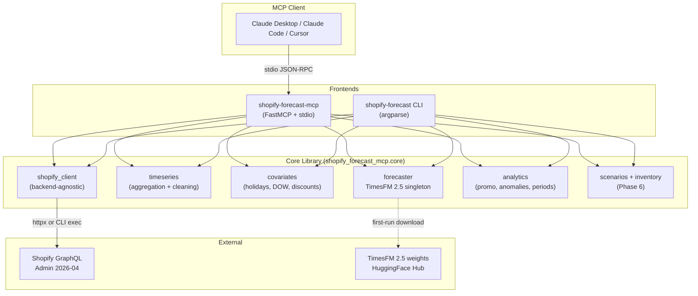
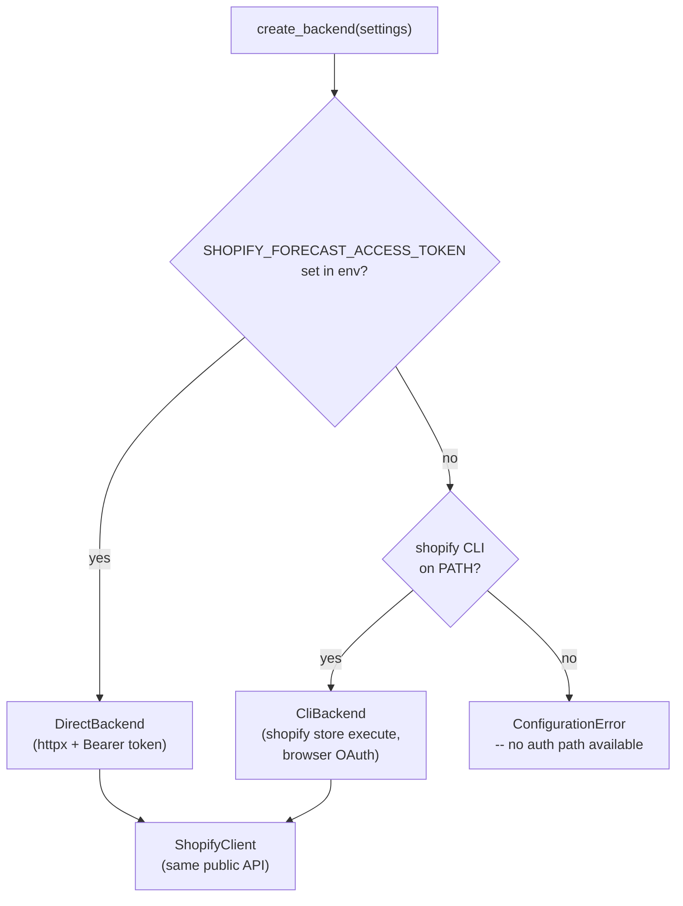

# Architecture

Design overview of `shopify-forecast-mcp`. For install and usage, see [SETUP.md](SETUP.md) and [TOOLS.md](TOOLS.md).

## Contents

- [Two-layer design](#two-layer-design)
- [Data flow](#data-flow)
- [Dual-backend Shopify access](#dual-backend-shopify-access)
- [Key design decisions](#key-design-decisions)

***

## Two-layer design

A pure-Python **core library** wrapped by a thin **MCP server**. The CLI consumes the same core — no MCP runtime dependency. This enables standalone CLI use, unit testing without MCP, and future alternate frontends (web, Sidekick extension) without refactoring core.

Core is importable anywhere — `from shopify_forecast_mcp.core.forecaster import get_engine` works in a plain Python script. The MCP and CLI layers are thin orchestrators that turn user input into core calls and core results into markdown.

***

## Data flow

End-to-end: Shopify orders in, `ForecastResult` out.

```mermaid
flowchart LR
    A["Shopify GraphQL<br/>Admin 2026-04"]
    B["fetch_orders<br/>(paginated or bulk JSONL)"]
    C["Normalize<br/>- strip GIDs<br/>- net revenue from subtotalPriceSet<br/>- refund-aware line items<br/>- drop test/draft/cancelled<br/>- bucket by shop TZ"]
    D["orders_to_daily_series<br/>(pd.Series, DatetimeIndex)"]
    E["resample_series<br/>(D/W/M)"]
    F["clean_series<br/>(IQR outlier cap,<br/>no data removal)"]
    G["Optional: build_covariates<br/>(day-of-week, holidays,<br/>discount flags)"]
    H["ForecastEngine.forecast<br/>(TimesFM 2.5 singleton)"]
    I["ForecastResult<br/>- point_forecast<br/>- quantile_forecast<br/>  [mean, q10..q90]<br/>- confidence_bands<br/>- dates, metadata"]
    J["to_table() + summary()<br/>-> markdown response"]

    A --> B --> C --> D --> E --> F
    F --> H
    F -.->|if covariates_enabled| G
    G -.-> H
    H --> I --> J
```

Key invariants:
- **Singleton model loading**: TimesFM 2.5 loads once per server lifecycle, not per request (~800MB RAM; per-request loading would be unusable).
- **Markdown responses only**: tool results are markdown strings; the MCP client renders tables natively.
- **Never raise from tool handlers**: errors are caught per-tool and returned as friendly markdown (`R7.7`).
- **Stdout clean**: all Python logging goes to stderr (`R7.8`); stdio transport uses stdout only for JSON-RPC framing.

***

## Dual-backend Shopify access

`ShopifyClient` is backend-agnostic. At startup, a factory inspects the runtime and chooses between two implementations:

| Backend | Auth | Used in | Trade-offs |
|---------|------|---------|------------|
| `DirectBackend` | Admin API access token (`shpat_...`) via env var | Docker (D-09), CI, any non-interactive shell | Requires manual token creation; works everywhere |
| `CliBackend` | Browser OAuth via `shopify store auth` | Host interactive use | No token to manage; requires Shopify CLI installed; doesn't work in containers |

Public API of `ShopifyClient` is identical across backends — the choice is transparent to core library consumers.

Both backends share identical normalization: `subtotalPriceSet.shopMoney.amount` (not `totalPriceSet`, which includes tax/shipping), refund-aware net revenue, timezone-correct bucketing by `ianaTimezone`, exclusion of test/draft/cancelled orders.

***

## Key design decisions

| Decision | Rationale | Location |
|----------|-----------|----------|
| **TimesFM 2.5 over Prophet/ARIMA** | Foundation model beats legacy methods on GIFT-Eval retail benchmark; zero-shot eliminates per-store training | `core/forecaster.py` |
| **Two-layer (core + MCP wrapper)** | Enables standalone CLI, unit testing without MCP runtime, future alternate frontends | `src/shopify_forecast_mcp/core/` vs `src/shopify_forecast_mcp/mcp/` |
| **Singleton TimesFM loading** | Model is ~800MB in memory; per-request loading is unusable | `core/forecaster.py` `get_engine()` |
| **Shopify GraphQL bulk ops** | Required for stores >10k orders; cost-based rate limit is more generous than REST | `core/shopify_client/bulk_ops.py` |
| **`subtotalPriceSet` for revenue** | Excludes tax + shipping — actual product revenue is what merchants forecast | `core/shopify_client/normalize.py` |
| **Markdown response format** | MCP clients render markdown natively; tables + summaries are merchant-readable | `mcp/tools.py` handlers |
| **Dual-backend architecture** | Merchant-on-laptop wants browser OAuth; server-side deploys need token-in-env | `core/shopify_backend/factory.py` |
| **TimesFM via `timecopilot-timesfm` PyPI fork** | Upstream `timesfm` on PyPI is still 2.0-only; PyPI rejects wheels with `git+https` deps. Community fork ships 2.5 under the same import path (Phase 7 D-23) | `pyproject.toml` |
| **Python 3.11 only (not 3.12)** | TimesFM + torch 3.12 compatibility not yet validated end-to-end; revisit in v0.2 | `pyproject.toml` `requires-python` |
| **`:bundled` Docker variant** | Merchants on spotty connections or privacy-conscious contexts benefit from offline-capable runtime; ~450MB image-size cost is acceptable | `Dockerfile` `runtime-bundled` stage |
| **Trusted Publisher OIDC (no PyPI token)** | Eliminates long-lived secret; short-lived OIDC tokens issued per workflow run | `.github/workflows/publish.yml` |
| **No npx wrapper** | `uvx` is the native Python equivalent; works in every MCP client config with no Node runtime | PRD R12.5 |
| **Covariates off by default** | Marginal accuracy gain over TimesFM alone on most retail series; feature flag prevents surprise behavior | `SHOPIFY_FORECAST_COVARIATES_ENABLED` |
| **Stderr-only logging** | Stdio transport reserves stdout for JSON-RPC framing; any `print()` in server code would break the protocol | `R7.8` enforced across server |

For full requirement traceability, see [.planning/REQUIREMENTS.md](../.planning/REQUIREMENTS.md) and [.planning/ROADMAP.md](../.planning/ROADMAP.md).

***

*Documentation for v0.1.0-alpha.*
